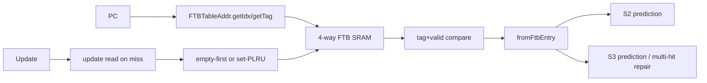

# Frontend FTB

## Scope

- Source: OpenXiangShan/XiangShan `kunminghu-v2`, commit `52262f303fc06daf84cdab7011d59b7df65ce7e8`.
- Relative source file: `src/main/scala/xiangshan/frontend/FTB.scala`.
- Effective instantiation: `Parameters.scala:126-143`.

## Role

`FTB` is the main fetch target buffer. It stores branch slots, tail jump slot, call/return/JALR attributes, partial fall-through address, and strong-bias bits. It enriches prediction in S2/S3 and supplies metadata for later training.

## Source Evidence

| Topic | Source lines | Core code | What it proves |
| --- | --- | --- | --- |
| Params | `FTB.scala:28-44` | `numEntries`, `numWays`, `numSets`, `tagLength` | Table geometry comes from core parameters. |
| Entry format | `FTB.scala:178-195` | `valid`, `brSlots`, `tailSlot`, `pftAddr`, `strong_bias` | Stored target metadata. |
| Target reconstruction | `FTB.scala:60-117`, `212-260` | lower bits + fit/overflow/underflow high bits | FTB stores compressed targets relative to PC. |
| Address hash | `FTB.scala:459-463` | `getIdx = addr.getIdx(x) ^ ...` | Skewed set index calculation. |
| SRAM bank | `FTB.scala:471-507` | `SplittedSRAMTemplate(new FTBEntryWithTag, set=numSets, way=numWays)` | Main storage is set-associative SRAM. |
| Read/hit | `FTB.scala:516-540` | set index, tag compare, `OHToUInt(total_hits)` | Lookup path. |
| Multi-hit handling | `FTB.scala:542-558`, `676-719`, `799-808` | `multi_hit`, `PriorityMux`, S3 redirect trigger | Multiple hits are tolerated by selecting one entry and redirecting. |
| Replacement/update | `FTB.scala:585-657`, `842-878` | set-PLRU, empty-way first, write path | Miss allocation and hit update. |

## Index and Storage

`FTBTableAddr` wraps `TableAddr` and skews the set index by XORing index and tag bits (`FTB.scala:459-463`). `FTBBank` reads either prediction PC or update PC on a single read port (`FTB.scala:516-523`) and asserts that prediction and update read requests are not simultaneous (`FTB.scala:523`). The table is `numSets = FtbSize / FtbWays`, `numWays = FtbWays` (`FTB.scala:28-32`, parameter values in `Parameters.scala:100-101`).

On a read, `req_tag` and `req_idx` are registered (`FTB.scala:528-529`), then every way compares tag and entry valid (`FTB.scala:533-538`). Hit way is `OHToUInt(total_hits)` (`FTB.scala:540`). If two ways hit, FTB registers all hits and uses `PriorityMux` to pick one entry for S3 while marking multi-hit (`FTB.scala:547-558`, `676-719`).

## Update and Replacement

FTB uses set-PLRU (`FTB.scala:585`). Allocation policy is: if any way in the set is invalid, choose `PriorityEncoder(~valids)`; otherwise use `replacer.way(idx)` (`FTB.scala:609-622`). Hit updates rewrite the recorded way (`FTB.scala:849-876`). Miss updates first issue an update read, stall S1 for the read cycle, and write two cycles later (`FTB.scala:849-878`).

## FauFTB Close Optimization

FTB compares the FauFTB-predicted entry with the FTB SRAM entry. If they agree for `FTBCLOSE_THRESHOLD` consecutive reads, FTB sets `s0_close_ftb_req` and later uses FauFTB's entry instead of reading FTB (`FTB.scala:663-741`). False-hit update or IFU redirect reopens FTB (`FTB.scala:754-761`).

## Algorithm Example Walkthrough

Example input: prediction PC is `0x8000_2000`; `FtbWays=4`, `FtbTagLength=20`, and `numSets=FtbSize/FtbWays` (`FTB.scala:28-32`, `Parameters.scala:100-101`). Assume `ftbAddr.getIdx(pc)` selects set 13 and `getTag(pc)` matches way 2.

1. Index/tag calculation: `FTB.scala:459-463` computes a skewed set index by XORing the normal index with selected tag/index bits. `FTB.scala:516-521` sends that set index to the single-port SRAM read request.
2. Hit detection: `FTB.scala:528-540` registers request tag/index, compares every way's tag and valid bit, and converts the one-hot hit vector to `hit_way`. With only way 2 matching, `hit=true` and `hit_way=2`.
3. Prediction payload: `FTB.scala:780-808` copies upstream response, marks S2/S3 hit, calls `fromFtbEntry`, and reconstructs target/fall-through information. If the entry's branch slot has `tarStat=TAR_FIT` and lower target bits for `0x8000_2040`, `getTargetVec` uses current PC high bits and those lower bits (`FTB.scala:60-117`, `212-260`).
4. Main update hit: if FTQ update metadata says `u_meta.hit=true`, `FTB.scala:842-878` sets `update_now`, writes the resolved entry back to way 2, and does not allocate.
5. Update miss/allocation: if `u_meta.hit=false`, FTB performs an update read, stalls S1 for the read window (`FTB.scala:849-855`), and after two cycles writes either the existing update-hit way or an allocated way. Allocation chooses an invalid way first, otherwise set-PLRU (`FTB.scala:609-622`, `635-657`).
6. Multi-hit example: if way 1 and way 2 both match, `FTB.scala:542-558` selects one by `PriorityMux`, `FTB.scala:676-719` carries `multi_hit`, and BPU S3 redirect logic can repair the target (`frontend/BPU.scala:837-854`).

Downstream effect: `full_pred.hit`, branch slot metadata, `targets`, `fallThroughAddr`, `last_stage_ftb_entry`, and `last_stage_meta` are updated for FTQ and later predictor training (`FTB.scala:799-812`).

## Stage-by-Stage Algorithm

| Stage | Inputs | Algorithm and state | Ready/stall | Output | Source lines |
| --- | --- | --- | --- | --- | --- |
| S0 read request | `s0_pc_dup(0)`, close-FTB flag | If not closed, compute skewed set index and issue single-port SRAM read. Update read and prediction read are mutually exclusive. | `req_pc.ready` comes from SRAM; update miss can block S1. | SRAM read request. | `FTB.scala:459-463`, `516-527`, `672-674`, `849-855` |
| S1 hit detect | Registered tag/index and SRAM data | Compare every way's tag/valid; compute hit way; register multi-hit evidence. | Multi-hit is tolerated for later redirect; malformed fall-through asserts. | `s1_hit`, `s1_read_resp`, writeWay metadata. | `FTB.scala:528-568`, `705-722` |
| S2 prediction | S1 entry, PC | Select FauFTB entry if FTB reads are closed, else SRAM entry; call `fromFtbEntry`; detect S2 multi-hit/fall-through. | S2 can still be overridden by S3. | S2 `full_pred`, hit, target/fall-through fields. | `FTB.scala:663-719`, `780-797` |
| S3 prediction | S2 registered entry | If multi-hit, use priority-selected entry; recompute S3 prediction and fall-through error. | None local; BPU checks S3 redirect causes. | S3 `full_pred`, `multiHit`, `last_stage_ftb_entry`, `last_stage_meta`. | `FTB.scala:694-719`, `799-812` |
| Update hit | FTQ update metadata hit | Write updated entry to recorded way. | Does not need update read. | Table entry rewritten, replacer touched. | `FTB.scala:842-878` |
| Update miss/allocation | FTQ update metadata miss | Read update PC to see current hit; allocate empty way first, otherwise set-PLRU. | `io.s1_ready` drops during update read and following cycle. | New FTB entry and tag written. | `FTB.scala:609-657`, `849-878` |

## Redirect Signal Generation

FTB does not own `s2_redirect_dup`/`s3_redirect_dup`, but it supplies the conditions that make BPU assert them.

| Condition | Producer | Redirect stage | BPU condition | Source lines |
| --- | --- | --- | --- | --- |
| S2 target/direction differs from S1 | FTB S2 `full_pred.fromFtbEntry` changes target/slot metadata. | S2 | `preds_needs_redirect_vec_dup` target/branch/taken/CFI diff. | `FTB.scala:780-797`, `frontend/BPU.scala:606-705` |
| S3 target differs from previous S2 | FTB S3 recomputes from registered entry. | S3 | `s3_redirect_on_target_dup`. | `FTB.scala:799-808`, `frontend/BPU.scala:827-854` |
| FTB multi-hit | `multi_hit` selected by registered hit vector. | S3 | `s3_redirect_on_ftb_multi_hit_dup`. | `FTB.scala:542-558`, `676-719`, `frontend/BPU.scala:837-854` |
| Fall-through error | entry pft/carry inconsistent with current fetch block lower bits. | S2/S3 | `fallThruError` participates in redirect. | `FTB.scala:697-703`, `807-839`, `frontend/BPU.scala:734`, `837-854` |
| FauFTB/FTB false-hit reopen | `update.false_hit` or `redirectFromIFU`. | Update/recovery | Not a fetch redirect itself; reopens FTB read path to avoid repeated bad fast predictions. | `FTB.scala:754-761` |

Example: if two FTB ways match one PC, `multi_hit` is true. FTB selects one entry with `PriorityMux`, marks `full_pred.multiHit`, and BPU asserts S3 redirect because `s3_redirect_on_ftb_multi_hit_dup` is true.

## Predictor Relationship

The effective Kunminghu frontend predictor chain is not a set of independent predictors voting in parallel. `Parameters.scala:124-143` constructs `FauFTB`, `Tage_SC`, `FTB`, `ITTage`, and `RAS`, connects them as `resp_in -> uftb -> tage -> ftb -> ittage -> ras`, and returns `ras.io.out` as the final composed prediction. `Bim.scala` is not part of this chain in this commit; its effective role is replaced by the `TageBTable` base table inside `Tage.scala:143-270`.

| Component | Relationship to the chain | What it contributes | How disagreement is handled | Source lines |
| --- | --- | --- | --- | --- |
| `BPU` / `Predictor` | Owns the pipeline, history state, redirect generators, and FTQ response. It does not compute every prediction locally; it drives `Composer`. | Shared PC/history inputs, stage fire/ready, global-history/folded-history repair, and final `io.bpu_to_ftq.resp`. | Compares later-stage composed predictions against earlier predictions and emits S2/S3/backend redirects. | `frontend/BPU.scala:381-455`, `606-635`, `698-725`, `827-854`, `915-1050` |
| `Composer` | Broadcasts common inputs/control to every component and gathers the final response from the configured chain. | Shared `s0_pc`, folded history, global history, stage fires, redirect, control, update, and concatenated `last_stage_meta`. | All components see the same redirect/update event; `io.in.ready` is the AND of component readiness, so one blocked predictor stalls the chain. | `frontend/Composer.scala:22-77` |
| `FauFTB` / uFTB | First and fast predictor in the chain. Its output feeds `Tage_SC`, and its entry/hit information also feeds `FTB`. | Early target/fall-through/entry information for fast S1 prediction. | Later `FTB`/`Tage`/`ITTAGE`/`RAS` output can refine it; BPU turns the difference into S2/S3 redirect. | `Parameters.scala:127-139`, `frontend/Composer.scala:25-31`, `frontend/FauFTB.scala:76-128` |
| `Tage_SC` | Receives uFTB output, then updates conditional branch direction before FTB/ITTAGE/RAS see the prediction. | TAGE direction plus SC correction over the base table and tagged tables. | If direction or first-taken branch differs from the fast prediction, BPU S2 comparison observes `takenDiff`/`lastBrPosOHDiff`. | `Parameters.scala:128-140`, `frontend/Tage.scala:778-846`, `frontend/SC.scala:259-372` |
| `FTB` | Receives TAGE-refined prediction and uFTB cached entry/hit information. | Direct branch/JAL target entries, branch-slot metadata, fall-through, multi-hit detection. | Target, CFI slot, fall-through, or multi-hit differences become S2/S3 redirect causes. | `Parameters.scala:126-138`, `frontend/FTB.scala:683-811`, `frontend/BPU.scala:827-854` |
| `ITTAGE` | Receives FTB output and specializes the JALR/indirect target path. | Indirect target override and ITTAGE metadata for later training. | If the indirect target changes after earlier stages, BPU observes target/JALR target differences and redirects. | `Parameters.scala:130-141`, `frontend/ITTAGE.scala:418-470`, `frontend/BPU.scala:827-854` |
| `RAS` / `newRAS` | Last component in the chain and therefore the final returned response. | Return target prediction, speculative stack pointer/top metadata, cancel/recovery behavior. | RAS target or cancel effects are reflected in final S3 prediction; backend redirect repairs RAS/history state through shared redirect/update paths. | `Parameters.scala:129-143`, `frontend/newRAS.scala:696-706`, `frontend/Composer.scala:37-56` |

Metadata and training are also chained. `Composer` concatenates each component's `last_stage_meta` in chain order (`frontend/Composer.scala:58-70`), FTQ stores that combined metadata (`frontend/NewFtq.scala:637`), and update walks components in reverse order to split the metadata back to each predictor (`frontend/Composer.scala:72-77`). This means a single FTQ update can train TAGE counters, FTB entries, ITTAGE target entries, and RAS state with the metadata each component produced during prediction.

Cross-predictor example: suppose uFTB predicts fall-through for PC `0x8000_1000`, but TAGE later marks branch slot 0 taken and FTB supplies target `0x8000_1080`. The chain first carries the uFTB result into `Tage_SC` and `FTB` (`Parameters.scala:136-140`). BPU records the earlier S1 prediction, compares it with the richer S2 composed response, and detects direction/target/CFI-index differences (`frontend/BPU.scala:606-635`, `698-705`). It then registers the S2 target, folded history, and global-history pointer into the next-PC/history generators (`frontend/BPU.scala:707-725`). If an even later RAS or ITTAGE target differs in S3, the S3 comparison checks branch-taken mask, target, JALR target, fall-through error, and FTB multi-hit before generating `s3_redirect` (`frontend/BPU.scala:827-854`).

## Scenarios

| Scenario | Trigger | Code | Result |
| --- | --- | --- | --- |
| Normal hit | One tag match and `btb_enable` | `FTB.scala:536-540`, `705-718` | S2/S3 `full_pred.hit` is true. |
| FTB miss update | `u_valid && !u_meta.hit` | `FTB.scala:849-878` | S1 ready drops while update read resolves target way. |
| Multi-hit | More than one way matches | `FTB.scala:542-558`, `676-719` | One entry selected; S3 marks multi-hit and BPU can redirect. |
| FauFTB close | Consistent FauFTB and FTB entries for threshold | `FTB.scala:724-741` | Main FTB read closes; FauFTB supplies entry. |
| Reopen | false hit or IFU redirect | `FTB.scala:754-761` | Counter clears and FTB reads resume. |

## Diagram

