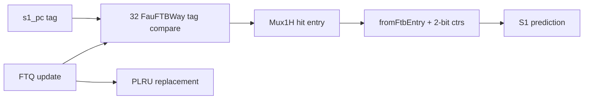

# Frontend FauFTB

## Scope

- Source: OpenXiangShan/XiangShan `kunminghu-v2`, commit `52262f303fc06daf84cdab7011d59b7df65ce7e8`.
- Relative source file: `src/main/scala/xiangshan/frontend/FauFTB.scala`.
- Effective instantiation: `Parameters.scala:126-143` instantiates `new FauFTB` as the first component in the default predictor chain.

## Role

`FauFTB` is the fast/uBTB-style target predictor. It produces an S1 prediction from a 32-way register-file-like structure, then passes its hit entry into `FTB` so FTB can close its SRAM read path when FauFTB and FTB stay consistent.

## Source Evidence

| Topic | Source lines | Core code | What it proves |
| --- | --- | --- | --- |
| Parameters | `FauFTB.scala:26-39` | `numWays = 32`, `tagSize = 16`, `getTag(pc)` | 32-entry fully associative-like fast table indexed by tag compare. |
| Entry way | `FauFTB.scala:43-74` | `data`, `tag`, `valid`, `write_valid` | Each way owns one entry, tag, valid bit. |
| Lookup | `FauFTB.scala:92-117` | `s1_hit_oh`, `Mux1H`, `fp.fromFtbEntry` | S1 tag compare selects predicted FTB entry and direction counters. |
| Saturating counters | `FauFTB.scala:86-108`, `187-198` | `ctrs(w)(br)` and `satUpdate` | Per-way/per-branch 2-bit direction state. |
| Replacement | `FauFTB.scala:89-90`, `162-205` | `ReplacementPolicy.fromString("plru")` | Update miss chooses PLRU way; hit rewrites hit way. |
| Metadata | `FauFTB.scala:78-84`, `127-132` | `FauFTBMeta(hit,pred_way)` | FTQ update can tell whether the original fast prediction hit and which way. |

## Index, Search, and Update

Lookup does not use a set index. Every way compares `getTag(s1_pc_dup(0))`, where `getTag(pc)=pc(tagSize + instOffsetBits - 1, instOffsetBits)` (`FauFTB.scala:38`, `92-98`). The one-hot hit vector selects both the FTB entry and the decoded `FullBranchPrediction` (`FauFTB.scala:99-117`). Multiple hits are illegal and trigger `XSError` (`FauFTB.scala:112`).

Update is two-stage. S0 captures update valid, PC, metadata, and compares all ways by update tag (`FauFTB.scala:143-160`). S1 chooses the hit way if present, otherwise PLRU allocation (`FauFTB.scala:162-170`), writes the entry/tag (`FauFTB.scala:171-175`), and updates the per-branch counters only for real branch slots that are not strong-bias entries (`FauFTB.scala:156-160`, `187-198`).

## Why It Exists

FauFTB gives a fast S1 target/direction guess before the larger FTB SRAM path completes. `FTB` consumes `io.fauftb_entry_in` and can close its own read path after a consistency threshold (`FTB.scala:663-741`), reducing pressure and energy on the main FTB.

## Algorithm Example Walkthrough

Example input: S1 PC is `0x8000_1234`; `instOffsetBits=1`, so `getTag(pc)` uses bits `[16:1]` for the 16-bit tag (`FauFTB.scala:26-39`). Assume way 7 has `valid=true`, matching tag, an FTB entry whose first branch slot targets `0x8000_1200`, and its branch counter is `2'b10`.

1. Lookup: every way compares `tag === req_tag && valid` (`FauFTB.scala:56-64`, `92-99`). Only way 7 hits, so `s1_hit_oh=1<<7`, `s1_hit=true`, and `s1_hit_way=7`.
2. Prediction construction: `FauFTB.scala:99-108` calls `fromFtbEntry` for every way, then sets `br_taken_mask(i) := c(i)(1) || e.strong_bias(i)`. With counter `2'b10`, MSB is `1`, so the example predicts taken for that slot.
3. Output: `FauFTB.scala:110-117` selects way 7 with `Mux1H`, writes `io.out.s1.full_pred`, and forwards the same entry through `io.fauftb_entry_out` for FTB consistency checking.
4. Update hit: suppose FTQ update later says the branch was not taken. `FauFTB.scala:151-170` finds way 7 by update tag and chooses that way instead of PLRU. `FauFTB.scala:187-198` applies `satUpdate(2'b10, 2, taken=false)`, producing `2'b01`.
5. Update miss: if no way matches the update tag, `FauFTB.scala:167-170` chooses `replacer.way`, writes the new FTB entry, and initializes future behavior through subsequent counter training.

Downstream effect: before update, `full_pred.br_taken_mask` is true in S1; after one not-taken training update, the same branch becomes weak-not-taken in FauFTB, while the main FTB/TAGE stages may still override it in S2/S3.

## Stage-by-Stage Algorithm

| Stage | Inputs | Algorithm and state | Ready/stall | Output | Source lines |
| --- | --- | --- | --- | --- | --- |
| S1 lookup | `s1_pc_dup(0)`, `ctrl.ubtb_enable` | All 32 ways compare `getTag(s1_pc)` against registered way tags; each way has `data/tag/valid`. | Inherits base predictor readiness; no SRAM read stall because ways are registers. | `s1_hit`, `s1_hit_way`, selected `FauFTBEntry`, S1 `full_pred`. | `FauFTB.scala:43-74`, `92-117` |
| S1 direction | selected entry and per-way counters | `fromFtbEntry` builds target metadata; each branch direction uses counter MSB or `strong_bias`. | Multiple hits assert error rather than arbitrate. | `br_taken_mask`, `fauftb_entry_out`, `fauftb_entry_hit_out`. | `FauFTB.scala:99-117` |
| S2/S3 metadata | S1 hit and hit way | Hit and pred-way are double-registered for update metadata. | None local. | `last_stage_meta` for FTQ update. | `FauFTB.scala:127-132` |
| Update S0 | FTQ update PC and metadata | Register update, compute update tag, compare all way tags including write bypass hit. | No read port stall. | `u_s0_hit_oh`, `u_s0_br_update_valids`. | `FauFTB.scala:143-160` |
| Update S1 | hit/miss result | Hit rewrites hit way; miss chooses PLRU allocation; writes entry/tag and trains counters. | PLRU touched by prediction and update. | Updated way entry, tag, counter, PLRU state. | `FauFTB.scala:162-205` |

## Redirect Signal Generation

FauFTB does not directly assert BPU redirect. It influences redirect by producing an early S1 prediction that later stages may override.

| Redirect-like effect | Condition | Stage | Downstream effect | Source lines |
| --- | --- | --- | --- | --- |
| S2 override caused by later predictor | FauFTB S1 target/direction differs from FTB/TAGE S2 result. | BPU S2 | `s2_redirect_dup` redirects to richer target/history. | `FauFTB.scala:114-117`, `frontend/BPU.scala:606-705` |
| FTB close/reopen interaction | FauFTB entry is forwarded to FTB; FTB may close main FTB reads when consistent, or reopen on false hit/IFU redirect. | FTB S1/S2/update | Can change whether later FTB SRAM result exists, affecting override opportunities. | `FauFTB.scala:116-117`, `FTB.scala:724-761` |
| Multiple FauFTB hits | `PopCount(s1_hit_oh) > 1`. | S1 | Assertion; no redirect repair path. | `FauFTB.scala:110-112` |

Example: FauFTB predicts taken from counter `2'b10`, but TAGE later changes `br_taken_mask` to not-taken. BPU's S2 comparison sees `takenDiff` and generates `s2_redirect_dup` through `frontend/BPU.scala:620-635` and `698-705`.

## Predictor Relationship

The effective Kunminghu frontend predictor chain is not a set of independent predictors voting in parallel. `Parameters.scala:124-143` constructs `FauFTB`, `Tage_SC`, `FTB`, `ITTage`, and `RAS`, connects them as `resp_in -> uftb -> tage -> ftb -> ittage -> ras`, and returns `ras.io.out` as the final composed prediction. `Bim.scala` is not part of this chain in this commit; its effective role is replaced by the `TageBTable` base table inside `Tage.scala:143-270`.

| Component | Relationship to the chain | What it contributes | How disagreement is handled | Source lines |
| --- | --- | --- | --- | --- |
| `BPU` / `Predictor` | Owns the pipeline, history state, redirect generators, and FTQ response. It does not compute every prediction locally; it drives `Composer`. | Shared PC/history inputs, stage fire/ready, global-history/folded-history repair, and final `io.bpu_to_ftq.resp`. | Compares later-stage composed predictions against earlier predictions and emits S2/S3/backend redirects. | `frontend/BPU.scala:381-455`, `606-635`, `698-725`, `827-854`, `915-1050` |
| `Composer` | Broadcasts common inputs/control to every component and gathers the final response from the configured chain. | Shared `s0_pc`, folded history, global history, stage fires, redirect, control, update, and concatenated `last_stage_meta`. | All components see the same redirect/update event; `io.in.ready` is the AND of component readiness, so one blocked predictor stalls the chain. | `frontend/Composer.scala:22-77` |
| `FauFTB` / uFTB | First and fast predictor in the chain. Its output feeds `Tage_SC`, and its entry/hit information also feeds `FTB`. | Early target/fall-through/entry information for fast S1 prediction. | Later `FTB`/`Tage`/`ITTAGE`/`RAS` output can refine it; BPU turns the difference into S2/S3 redirect. | `Parameters.scala:127-139`, `frontend/Composer.scala:25-31`, `frontend/FauFTB.scala:76-128` |
| `Tage_SC` | Receives uFTB output, then updates conditional branch direction before FTB/ITTAGE/RAS see the prediction. | TAGE direction plus SC correction over the base table and tagged tables. | If direction or first-taken branch differs from the fast prediction, BPU S2 comparison observes `takenDiff`/`lastBrPosOHDiff`. | `Parameters.scala:128-140`, `frontend/Tage.scala:778-846`, `frontend/SC.scala:259-372` |
| `FTB` | Receives TAGE-refined prediction and uFTB cached entry/hit information. | Direct branch/JAL target entries, branch-slot metadata, fall-through, multi-hit detection. | Target, CFI slot, fall-through, or multi-hit differences become S2/S3 redirect causes. | `Parameters.scala:126-138`, `frontend/FTB.scala:683-811`, `frontend/BPU.scala:827-854` |
| `ITTAGE` | Receives FTB output and specializes the JALR/indirect target path. | Indirect target override and ITTAGE metadata for later training. | If the indirect target changes after earlier stages, BPU observes target/JALR target differences and redirects. | `Parameters.scala:130-141`, `frontend/ITTAGE.scala:418-470`, `frontend/BPU.scala:827-854` |
| `RAS` / `newRAS` | Last component in the chain and therefore the final returned response. | Return target prediction, speculative stack pointer/top metadata, cancel/recovery behavior. | RAS target or cancel effects are reflected in final S3 prediction; backend redirect repairs RAS/history state through shared redirect/update paths. | `Parameters.scala:129-143`, `frontend/newRAS.scala:696-706`, `frontend/Composer.scala:37-56` |

Metadata and training are also chained. `Composer` concatenates each component's `last_stage_meta` in chain order (`frontend/Composer.scala:58-70`), FTQ stores that combined metadata (`frontend/NewFtq.scala:637`), and update walks components in reverse order to split the metadata back to each predictor (`frontend/Composer.scala:72-77`). This means a single FTQ update can train TAGE counters, FTB entries, ITTAGE target entries, and RAS state with the metadata each component produced during prediction.

Cross-predictor example: suppose uFTB predicts fall-through for PC `0x8000_1000`, but TAGE later marks branch slot 0 taken and FTB supplies target `0x8000_1080`. The chain first carries the uFTB result into `Tage_SC` and `FTB` (`Parameters.scala:136-140`). BPU records the earlier S1 prediction, compares it with the richer S2 composed response, and detects direction/target/CFI-index differences (`frontend/BPU.scala:606-635`, `698-705`). It then registers the S2 target, folded history, and global-history pointer into the next-PC/history generators (`frontend/BPU.scala:707-725`). If an even later RAS or ITTAGE target differs in S3, the S3 comparison checks branch-taken mask, target, JALR target, fall-through error, and FTB multi-hit before generating `s3_redirect` (`frontend/BPU.scala:827-854`).

## Scenarios

| Scenario | Trigger | Code | Result |
| --- | --- | --- | --- |
| Fast hit | Any valid way tag matches S1 PC and `ubtb_enable` is set | `FauFTB.scala:96-117` | S1 full prediction and FauFTB entry are emitted. |
| Multiple hit | More than one way matches | `FauFTB.scala:110-112` | Hardware error assertion; design assumes unique tags. |
| Update hit | Update tag matches existing way | `FauFTB.scala:151-170` | Rewrite same way and touch PLRU. |
| Update miss | No existing way matches | `FauFTB.scala:167-170` | Allocate PLRU way. |
| Counter training | Branch valid and not strong bias | `FauFTB.scala:156-160`, `190-195` | 2-bit counter increments/decrements with resolved taken. |

## Diagram

