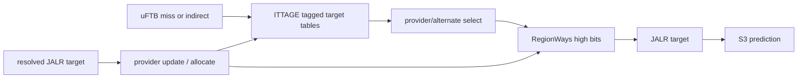

# Frontend ITTAGE

## Scope

- Source: OpenXiangShan/XiangShan `kunminghu-v2`, commit `52262f303fc06daf84cdab7011d59b7df65ce7e8`.
- Relative source file: `src/main/scala/xiangshan/frontend/ITTAGE.scala`.
- Effective instantiation: `Parameters.scala:130-143`.

## Paper Context

The source cites Andre Seznec, `A 64-Kbytes ITTAGE indirect branch predictor` (`ITTAGE.scala:18-23`). MCP search for ITTAGE returned related geometric-history branch prediction papers but not a richer direct result; this analysis therefore uses the source-cited paper as the primary algorithm context. Principle: use TAGE-like tagged history tables to predict indirect branch targets, with provider/alternate target selection and allocation on target misprediction.

## Source Evidence

| Topic | Source lines | Core code | What it proves |
| --- | --- | --- | --- |
| Params | `ITTAGE.scala:39-64`, `Parameters.scala:112-118` | table count, ctr bits, target region/offset | ITTAGE table geometry and target compression. |
| Region table | `ITTAGE.scala:133-195` | `RegionWays`, PLRU, region pointer | High target bits stored in shared region table. |
| Table hash | `ITTAGE.scala:223-243`, `258-266` | PC/folded-history idx/tag | TAGE-like indirect target table indexing. |
| Table read/write | `ITTAGE.scala:269-359` | `FoldedSRAMTemplate`, bitmask writes, useful reset | Single-way tagged entries with useful bit and target offset. |
| Access qualification | `ITTAGE.scala:433-437`, `539-544` | `s1_isIndirect` | ITTAGE only accesses for uFTB miss or uFTB-indirect cases. |
| Provider select | `ITTAGE.scala:552-600` | `ParallelSelectTwo(inputRes.reverse)` | Provider/alternate target choice. |
| Metadata/allocation | `ITTAGE.scala:619-640` | provider/alt/allocate metadata | FTQ stores provider state and allocation candidate. |
| Update | `ITTAGE.scala:642-748` | provider update, allocation, useful reset | Target training behavior. |

## Lookup Algorithm

ITTAGE computes `unhashed_idx = pc >> instOffsetBits` (`ITTAGE.scala:258-263`). Each table folds global history into index and tag; if history length is zero, only PC bits are used (`ITTAGE.scala:231-243`). A read hit requires entry valid and tag match, and is suppressed when there is a same-cycle read/write conflict (`ITTAGE.scala:290-299`).

The module only fires table requests when the fast path suggests an indirect branch is relevant: uFTB miss while FTB is open, or uFTB has an indirect JALR (`ITTAGE.scala:433-437`, `539-544`). Provider and alternate are selected from reversed table order (`ITTAGE.scala:552-570`), so longer-history hits take priority.

Targets are stored as offset plus region pointer. If the region pointer is valid and not marked `usePCRegion`, target high bits come from `RegionWays`; otherwise the current PC region is used (`ITTAGE.scala:572-585`). Provider target, alternate target, or base FTB JALR target is selected by provider/alt availability and provider counter zero state (`ITTAGE.scala:596-600`). The selected target overwrites `jalr_target` in S3 (`ITTAGE.scala:613-617`).

## Update Algorithm

Only non-return JALR updates that match the FTB tail slot train ITTAGE (`ITTAGE.scala:517-520`). Existing provider entries update correctness, useful bit, counter, and target offset (`ITTAGE.scala:670-698`). If the provider was null and alternate was used incorrectly, the alternate is also updated (`ITTAGE.scala:672-683`). On target misprediction, ITTAGE allocates the saved candidate unless the provider was correct but unconfident (`ITTAGE.scala:709-724`). Tick saturation resets useful bits (`ITTAGE.scala:730-733`).

## Algorithm Example Walkthrough

Example input: fetch block contains a taken non-return JALR at tail slot. uFTB hit says the block has an indirect JALR, so `s1_isIndirect=true`. The base FTB target is `0x8000_4000`. ITTAGE table 3 hits with target offset `0x12345`, region pointer 5, and region table entry 5 contains region high bits for `0x9000_0000`.

1. Access gate: `ITTAGE.scala:433-437` sets `s1_isIndirect` when uFTB missed while FTB is open or uFTB reports an indirect JALR. `ITTAGE.scala:539-544` only fires table requests under that condition.
2. Index/tag: each table computes `unhashed_idx = pc >> instOffsetBits` and folds history into index/tag (`ITTAGE.scala:231-243`, `258-266`).
3. Provider select: `ITTAGE.scala:552-570` wraps each valid table response and uses `ParallelSelectTwo(inputRes.reverse)`. Table 3 wins as provider; a lower table may become alternate.
4. Target reconstruction: `ITTAGE.scala:572-585` reads `RegionWays` by the stored pointer. Since pointer 5 is valid and `usePCRegion=false`, the target becomes `Cat(region[5], offset)=0x9001_2345` in representative form. If the region entry missed, current PC region would be used instead.
5. Output: `ITTAGE.scala:596-600` selects provider target unless provider counter is null and alternate exists. `ITTAGE.scala:613-617` writes this selected target into `fp.jalr_target` for S3.
6. Update: if backend resolves actual target `0x9001_2350`, `ITTAGE.scala:517-520` qualifies the update because it is a non-return JALR in the FTB tail slot. `ITTAGE.scala:670-698` updates provider correctness/useful/target state. Since target differs, `ITTAGE.scala:709-724` allocates the saved candidate unless the provider was correct-but-unconfident.

Downstream effect: the example changes the JALR target from FTB base `0x8000_4000` to ITTAGE target `0x9001_2345`; if this differs from previous S2 target, BPU S3 redirect repairs next PC (`frontend/BPU.scala:827-854`).

## Stage-by-Stage Algorithm

| Stage | Inputs | Algorithm and state | Ready/stall | Output | Source lines |
| --- | --- | --- | --- | --- | --- |
| S1 gate/request | uFTB/FTB info, S1 PC/folded history | Access only when uFTB missed while FTB open or uFTB reports indirect JALR; each table computes history-folded index/tag. | `io.s1_ready` is all ITTAGE table ready. | ITTAGE table read requests. | `ITTAGE.scala:433-437`, `539-544`, `750-752` |
| Table S0/S1 | table-local PC/history | Table computes index/tag, reads SRAM, suppresses hit on read/write conflict. | Single-port SRAM write can block readiness. | `resp.valid`, counter, useful, target offset. | `ITTAGE.scala:231-299`, `337-359` |
| S2 provider/target | table responses, base FTB JALR target, region table | Select provider/alternate, read target region pointers, reconstruct provider/alt targets, choose provider/alt/base target. | None local. | `s2_tageTarget`, provider metadata. | `ITTAGE.scala:552-610` |
| S3 target output | registered S2 target | Write selected target into every `full_pred.jalr_target`. | Can trigger BPU S3 target redirect. | S3 JALR target and ITTAGE meta. | `ITTAGE.scala:613-629` |
| Update | resolved non-return JALR | Update provider/alt, allocate on target mispred, write region table for target high bits, reset useful on pressure. | Writes can conflict with later reads. | Updated ITTAGE entries and region table. | `ITTAGE.scala:642-748` |

## Redirect Signal Generation

ITTAGE changes indirect target, so its primary redirect influence is BPU S3 target comparison.

| Redirect influence | Condition | Stage | BPU generation | Source lines |
| --- | --- | --- | --- | --- |
| JALR target override | ITTAGE provider/alternate target differs from FTB base target. | S3 | `s3_redirect_on_target_dup` or `s3_redirect_on_jalr_target_dup` becomes true. | `ITTAGE.scala:596-617`, `frontend/BPU.scala:833-854` |
| ITTAGE not used | `s1_isIndirect=false`. | S1 | No ITTAGE target change, so no ITTAGE-caused redirect. | `ITTAGE.scala:433-437`, `755-756` |
| Read/write conflict | table read suppressed during update conflict. | Table S1 | Provider may be absent; base target remains, possibly avoiding or delaying redirect. | `ITTAGE.scala:292-299`, `367-370` |
| Update allocation | resolved target mispred and allocation valid. | Update | No immediate redirect; future JALR target prediction changes. | `ITTAGE.scala:709-748` |

Example: FTB base JALR target is `0x8000_4000`, but ITTAGE provider reconstructs `0x9001_2345`. S3 writes the latter into `jalr_target`; BPU compares S3 target with previous S2 target and asserts S3 redirect.

## Predictor Relationship

The effective Kunminghu frontend predictor chain is not a set of independent predictors voting in parallel. `Parameters.scala:124-143` constructs `FauFTB`, `Tage_SC`, `FTB`, `ITTage`, and `RAS`, connects them as `resp_in -> uftb -> tage -> ftb -> ittage -> ras`, and returns `ras.io.out` as the final composed prediction. `Bim.scala` is not part of this chain in this commit; its effective role is replaced by the `TageBTable` base table inside `Tage.scala:143-270`.

| Component | Relationship to the chain | What it contributes | How disagreement is handled | Source lines |
| --- | --- | --- | --- | --- |
| `BPU` / `Predictor` | Owns the pipeline, history state, redirect generators, and FTQ response. It does not compute every prediction locally; it drives `Composer`. | Shared PC/history inputs, stage fire/ready, global-history/folded-history repair, and final `io.bpu_to_ftq.resp`. | Compares later-stage composed predictions against earlier predictions and emits S2/S3/backend redirects. | `frontend/BPU.scala:381-455`, `606-635`, `698-725`, `827-854`, `915-1050` |
| `Composer` | Broadcasts common inputs/control to every component and gathers the final response from the configured chain. | Shared `s0_pc`, folded history, global history, stage fires, redirect, control, update, and concatenated `last_stage_meta`. | All components see the same redirect/update event; `io.in.ready` is the AND of component readiness, so one blocked predictor stalls the chain. | `frontend/Composer.scala:22-77` |
| `FauFTB` / uFTB | First and fast predictor in the chain. Its output feeds `Tage_SC`, and its entry/hit information also feeds `FTB`. | Early target/fall-through/entry information for fast S1 prediction. | Later `FTB`/`Tage`/`ITTAGE`/`RAS` output can refine it; BPU turns the difference into S2/S3 redirect. | `Parameters.scala:127-139`, `frontend/Composer.scala:25-31`, `frontend/FauFTB.scala:76-128` |
| `Tage_SC` | Receives uFTB output, then updates conditional branch direction before FTB/ITTAGE/RAS see the prediction. | TAGE direction plus SC correction over the base table and tagged tables. | If direction or first-taken branch differs from the fast prediction, BPU S2 comparison observes `takenDiff`/`lastBrPosOHDiff`. | `Parameters.scala:128-140`, `frontend/Tage.scala:778-846`, `frontend/SC.scala:259-372` |
| `FTB` | Receives TAGE-refined prediction and uFTB cached entry/hit information. | Direct branch/JAL target entries, branch-slot metadata, fall-through, multi-hit detection. | Target, CFI slot, fall-through, or multi-hit differences become S2/S3 redirect causes. | `Parameters.scala:126-138`, `frontend/FTB.scala:683-811`, `frontend/BPU.scala:827-854` |
| `ITTAGE` | Receives FTB output and specializes the JALR/indirect target path. | Indirect target override and ITTAGE metadata for later training. | If the indirect target changes after earlier stages, BPU observes target/JALR target differences and redirects. | `Parameters.scala:130-141`, `frontend/ITTAGE.scala:418-470`, `frontend/BPU.scala:827-854` |
| `RAS` / `newRAS` | Last component in the chain and therefore the final returned response. | Return target prediction, speculative stack pointer/top metadata, cancel/recovery behavior. | RAS target or cancel effects are reflected in final S3 prediction; backend redirect repairs RAS/history state through shared redirect/update paths. | `Parameters.scala:129-143`, `frontend/newRAS.scala:696-706`, `frontend/Composer.scala:37-56` |

Metadata and training are also chained. `Composer` concatenates each component's `last_stage_meta` in chain order (`frontend/Composer.scala:58-70`), FTQ stores that combined metadata (`frontend/NewFtq.scala:637`), and update walks components in reverse order to split the metadata back to each predictor (`frontend/Composer.scala:72-77`). This means a single FTQ update can train TAGE counters, FTB entries, ITTAGE target entries, and RAS state with the metadata each component produced during prediction.

Cross-predictor example: suppose uFTB predicts fall-through for PC `0x8000_1000`, but TAGE later marks branch slot 0 taken and FTB supplies target `0x8000_1080`. The chain first carries the uFTB result into `Tage_SC` and `FTB` (`Parameters.scala:136-140`). BPU records the earlier S1 prediction, compares it with the richer S2 composed response, and detects direction/target/CFI-index differences (`frontend/BPU.scala:606-635`, `698-705`). It then registers the S2 target, folded history, and global-history pointer into the next-PC/history generators (`frontend/BPU.scala:707-725`). If an even later RAS or ITTAGE target differs in S3, the S3 comparison checks branch-taken mask, target, JALR target, fall-through error, and FTB multi-hit before generating `s3_redirect` (`frontend/BPU.scala:827-854`).

## Scenarios

| Scenario | Trigger | Code | Result |
| --- | --- | --- | --- |
| uFTB says no indirect | uFTB hit and no indirect | `ITTAGE.scala:433-437`, `755-756` | ITTAGE table access is closed. |
| Provider hit | One or more tables hit | `ITTAGE.scala:552-600` | Longest provider target selected. |
| Provider null with alternate | provider counter zero and alt exists | `ITTAGE.scala:570-600` | Alternate target selected. |
| Target region miss | Region pointer invalid or `usePCRegion` | `ITTAGE.scala:575-585` | Current PC region reconstructs target high bits. |
| Target mispredict | resolved target differs and allocation candidate valid | `ITTAGE.scala:709-724` | New table entry allocated. |

## Diagram

