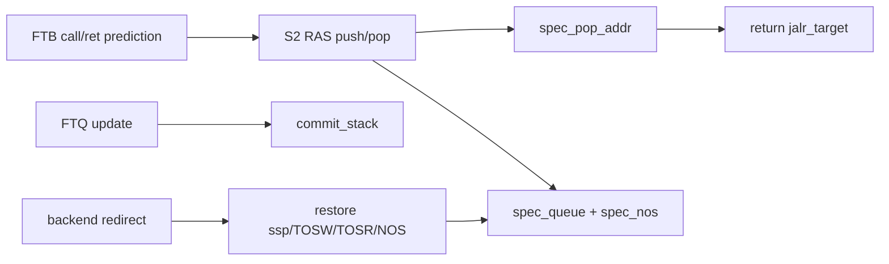

# Frontend RAS

## Scope

- Source: OpenXiangShan/XiangShan `kunminghu-v2`, commit `52262f303fc06daf84cdab7011d59b7df65ce7e8`.
- Effective relative source file: `src/main/scala/xiangshan/frontend/newRAS.scala`.
- Historical/non-effective file: `src/main/scala/xiangshan/frontend/RAS.scala` is commented out from line 16 onward and does not define effective code in this commit.

## Paper Context

`newRAS.scala` cites Skadron et al., `Improving prediction for procedure returns with return-address-stack repair mechanisms` and a persistent-stack return-address predictor paper (`newRAS.scala:18-26`). MCP search also found the Skadron MICRO paper DOI `10.1109/MICRO.1998.742787`. Principle: predict returns by a stack of call fall-through addresses, and repair speculative stack state after mispredicted-path execution.

## Source Evidence

| Topic | Source lines | Core code | What it proves |
| --- | --- | --- | --- |
| Entry/meta | `newRAS.scala:38-88` | `RASEntry`, `RASPtr`, `RASMeta` | Metadata saved for repair. |
| Storage | `newRAS.scala:155-168` | `commit_stack`, `spec_queue`, `spec_nos`, `ssp/sctr/TOSR/TOSW/BOS` | RAS separates committed stack and speculative queue. |
| Top read/bypass | `newRAS.scala:175-226` | `TOSRinRange`, `getTop`, `getTopNos` | Top can come from bypass, speculative queue, or commit stack. |
| Spec push/pop | `newRAS.scala:432-481` | `specPush`, `specPop` | Prediction-time call/return stack movement. |
| Commit update | `newRAS.scala:511-565` | `commit_push_valid`, `commit_pop_valid` | Committed RAS stack is repaired/trained at update. |
| Redirect repair | `newRAS.scala:567-592`, `708-727` | restore TOS/ssp/sctr and redo call/ret | Misprediction restores saved metadata and replays resolved CFI effect. |
| BPU integration | `newRAS.scala:607-752` | S2/S3 return target override and update | RAS participates in S2/S3 prediction and commit update. |

## Storage Model

`commit_stack` has `RasSize` entries and represents committed return-address state (`newRAS.scala:155`). `spec_queue` has `RasSpecSize` entries and records speculative pushes (`newRAS.scala:156`). `spec_nos` links each speculative entry to the next older top (`newRAS.scala:157`). Pointers `TOSR`, `TOSW`, `BOS` delimit readable top, write pointer, and bottom of speculative queue (`newRAS.scala:162-168`).

Repeated calls to the same return address are compressed using `ctr`; push increments `ctr` when the top return address matches and counter is not saturated, otherwise it allocates a new logical stack layer (`newRAS.scala:262-273`, `432-449`). Pop decrements `ctr` first; when zero, it moves to `NOS` or committed stack (`newRAS.scala:454-481`).

## Prediction Path

RAS observes the incoming FTB prediction in S2. If the taken CFI is a call, it speculatively pushes fall-through address; if it is a return, it speculatively pops (`newRAS.scala:607-622`). For return prediction, `stack.spec_pop_addr` overwrites `jalr_target` in S2 when `ras_enable` is true (`newRAS.scala:626-641`). The same target is carried to S3 and can override S3 JALR target (`newRAS.scala:650-671`).

If S3 discovers that S2 missed a push or pop, `s3_cancel` restores the S2 metadata and applies the missing operation (`newRAS.scala:673-691`, `494-508`). This prevents RAS corruption when FTB/TAGE later changes which CFI is actually taken.

## Commit and Redirect Repair

On backend/FTQ redirect, RAS restores saved metadata (`ssp`, `sctr`, `TOSW`, `TOSR`, `NOS`) and redoes the resolved call or return operation if needed (`newRAS.scala:708-727`, `567-592`). At update/commit time, committed pushes and pops update `commit_stack` and `nsp`, using saved `TOSW/ssp` metadata to align speculative and committed state (`newRAS.scala:728-752`, `511-565`).

## Algorithm Example Walkthrough

Example input: `RasSize=16`, `RasSpecSize=32`; committed top return address is `0x8000_5004`, `ssp=3`, `sctr=0`, and speculative queue is empty. The fetch block first predicts a taken call at `0x8000_5000`, then later a taken return.

1. Call push: `newRAS.scala:607-622` detects `hit_taken_on_call` in S2 and computes push address as fall-through plus possible RVI-call fixup. If fall-through is `0x8000_5004`, `stack.spec_push_valid` is asserted unless near overflow.
2. Spec stack update: `newRAS.scala:432-453` runs `specPush`. Because the current top return address differs from `0x8000_5004`, it writes a new speculative entry at `TOSW`, moves `TOSR := TOSW`, increments `TOSW`, and increments `ssp`.
3. Return prediction: when a later block has `hit_taken_on_ret`, `newRAS.scala:626-641` replaces `jalr_target` with `stack.spec_pop_addr`. `getTop` selects bypass/speculative/committed top in that order (`newRAS.scala:175-226`), so the just-pushed `0x8000_5004` can be predicted even before commit.
4. Spec pop: `newRAS.scala:454-481` decrements `sctr` if nested-call counter is nonzero, otherwise moves to `NOS` or committed stack. The predicted return consumes the top speculative entry.
5. S3 correction: if S2 thought the CFI was not a return but S3 says it is, `s3_cancel` is true (`newRAS.scala:673-691`). `newRAS.scala:494-508` restores S2 metadata and applies the missed pop or push.
6. Backend redirect: if backend resolves a return misprediction, `newRAS.scala:708-727` restores saved `ssp/sctr/TOSW/TOSR/NOS` metadata and redoes the resolved call/ret operation through `newRAS.scala:567-592`.
7. Commit update: once FTQ update commits the call, `newRAS.scala:728-752` drives `commit_push_valid`; `newRAS.scala:511-565` updates `commit_stack` and `nsp`, retiring speculative state into committed RAS state.

Downstream effect: for the return block, `full_pred.jalr_target` is replaced by `0x8000_5004`, and `last_stage_spec_info` carries RAS metadata for later redirect repair (`newRAS.scala:696-706`).

## Stage-by-Stage Algorithm

| Stage | Inputs | Algorithm and state | Ready/stall | Output | Source lines |
| --- | --- | --- | --- | --- | --- |
| S2 call/ret detect | S2 FTB/ITTAGE prediction | Detect hit-taken call/return, compute call fall-through push address, gate push/pop on near-overflow. | Near overflow disables speculative push/pop. | `spec_push_valid`, `spec_pop_valid`, `spec_push_addr`. | `newRAS.scala:607-622` |
| Stack combinational/top | `ssp/sctr/TOSR/TOSW/BOS`, bypass state | `getTop` chooses write-bypass, speculative queue, or commit stack; `getTopNos` selects next older speculative pointer. | No ready/valid; pointer range controls source. | `spec_pop_addr` for return target. | `newRAS.scala:175-226`, `254-260` |
| S2 target output | return prediction and RAS enable | If S2 is return and RAS enabled, overwrite `jalr_target`; update `targets.last` for JALR. | None local. | S2 return target. | `newRAS.scala:626-641` |
| S3 correction | registered S2 RAS action and S3 true call/ret classification | Detect missed push/pop and restore S2 metadata before applying missing action. | `s3_cancel` gated by near-overflow. | Corrected RAS speculative state and S3 return target. | `newRAS.scala:650-691`, `494-508` |
| Redirect recovery | backend/FTQ redirect cfi metadata | Restore saved `ssp/sctr/TOSW/TOSR/NOS`; redo resolved call or ret if redirect CFI is call/ret. | Recovery is gated by pointer ordering or not near-overflow. | Repaired RAS speculative state. | `newRAS.scala:708-727`, `567-592` |
| Commit update | FTQ update | Commit call pushes and ret pops update `commit_stack` and `nsp`; `BOS` advances. | Commit metadata mismatch forces `nsp` alignment. | Committed RAS state. | `newRAS.scala:511-565`, `728-752` |

## Redirect Signal Generation

RAS has predictor-local cancel/recovery and also influences BPU-level target redirect.

| Signal/effect | Producer and condition | Stage | Repaired state | Consumer/effect | Source lines |
| --- | --- | --- | --- | --- | --- |
| `s3_cancel` | S2 push/pop decision differs from S3 true call/ret. | S3 | Restores `TOSR/TOSW/ssp/sctr` and applies missed push/pop. | RAS stack state repaired; can change S3 target. | `newRAS.scala:673-691`, `494-508` |
| Backend RAS recovery | redirect level 0 CFI is call or return. | Recovery | Restores saved metadata and redoes call/ret effect. | Future return predictions use repaired stack. | `newRAS.scala:708-727`, `567-592` |
| BPU target redirect influenced by RAS | RAS return target differs from previous target. | S2/S3 | BPU PC/history, not RAS metadata, is redirected by BPU. | `s2_redirect` or `s3_redirect_on_target`. | `newRAS.scala:626-671`, `frontend/BPU.scala:606-705`, `827-854` |
| Near-overflow suppression | speculative queue near overflow. | S2/S3 | Avoids unsafe speculative pointer movement. | May reduce RAS-caused target changes. | `newRAS.scala:594-601`, `615-616`, `684` |

Example: S2 did not pop because FTB had not identified a return, but S3 identifies `hit_taken_on_ret`. `s3_cancel` restores S2 metadata, applies `specPop`, and S3 target can differ from previous S2 target, which BPU then redirects through S3 target comparison.

## Predictor Relationship

The effective Kunminghu frontend predictor chain is not a set of independent predictors voting in parallel. `Parameters.scala:124-143` constructs `FauFTB`, `Tage_SC`, `FTB`, `ITTage`, and `RAS`, connects them as `resp_in -> uftb -> tage -> ftb -> ittage -> ras`, and returns `ras.io.out` as the final composed prediction. `Bim.scala` is not part of this chain in this commit; its effective role is replaced by the `TageBTable` base table inside `Tage.scala:143-270`.

| Component | Relationship to the chain | What it contributes | How disagreement is handled | Source lines |
| --- | --- | --- | --- | --- |
| `BPU` / `Predictor` | Owns the pipeline, history state, redirect generators, and FTQ response. It does not compute every prediction locally; it drives `Composer`. | Shared PC/history inputs, stage fire/ready, global-history/folded-history repair, and final `io.bpu_to_ftq.resp`. | Compares later-stage composed predictions against earlier predictions and emits S2/S3/backend redirects. | `frontend/BPU.scala:381-455`, `606-635`, `698-725`, `827-854`, `915-1050` |
| `Composer` | Broadcasts common inputs/control to every component and gathers the final response from the configured chain. | Shared `s0_pc`, folded history, global history, stage fires, redirect, control, update, and concatenated `last_stage_meta`. | All components see the same redirect/update event; `io.in.ready` is the AND of component readiness, so one blocked predictor stalls the chain. | `frontend/Composer.scala:22-77` |
| `FauFTB` / uFTB | First and fast predictor in the chain. Its output feeds `Tage_SC`, and its entry/hit information also feeds `FTB`. | Early target/fall-through/entry information for fast S1 prediction. | Later `FTB`/`Tage`/`ITTAGE`/`RAS` output can refine it; BPU turns the difference into S2/S3 redirect. | `Parameters.scala:127-139`, `frontend/Composer.scala:25-31`, `frontend/FauFTB.scala:76-128` |
| `Tage_SC` | Receives uFTB output, then updates conditional branch direction before FTB/ITTAGE/RAS see the prediction. | TAGE direction plus SC correction over the base table and tagged tables. | If direction or first-taken branch differs from the fast prediction, BPU S2 comparison observes `takenDiff`/`lastBrPosOHDiff`. | `Parameters.scala:128-140`, `frontend/Tage.scala:778-846`, `frontend/SC.scala:259-372` |
| `FTB` | Receives TAGE-refined prediction and uFTB cached entry/hit information. | Direct branch/JAL target entries, branch-slot metadata, fall-through, multi-hit detection. | Target, CFI slot, fall-through, or multi-hit differences become S2/S3 redirect causes. | `Parameters.scala:126-138`, `frontend/FTB.scala:683-811`, `frontend/BPU.scala:827-854` |
| `ITTAGE` | Receives FTB output and specializes the JALR/indirect target path. | Indirect target override and ITTAGE metadata for later training. | If the indirect target changes after earlier stages, BPU observes target/JALR target differences and redirects. | `Parameters.scala:130-141`, `frontend/ITTAGE.scala:418-470`, `frontend/BPU.scala:827-854` |
| `RAS` / `newRAS` | Last component in the chain and therefore the final returned response. | Return target prediction, speculative stack pointer/top metadata, cancel/recovery behavior. | RAS target or cancel effects are reflected in final S3 prediction; backend redirect repairs RAS/history state through shared redirect/update paths. | `Parameters.scala:129-143`, `frontend/newRAS.scala:696-706`, `frontend/Composer.scala:37-56` |

Metadata and training are also chained. `Composer` concatenates each component's `last_stage_meta` in chain order (`frontend/Composer.scala:58-70`), FTQ stores that combined metadata (`frontend/NewFtq.scala:637`), and update walks components in reverse order to split the metadata back to each predictor (`frontend/Composer.scala:72-77`). This means a single FTQ update can train TAGE counters, FTB entries, ITTAGE target entries, and RAS state with the metadata each component produced during prediction.

Cross-predictor example: suppose uFTB predicts fall-through for PC `0x8000_1000`, but TAGE later marks branch slot 0 taken and FTB supplies target `0x8000_1080`. The chain first carries the uFTB result into `Tage_SC` and `FTB` (`Parameters.scala:136-140`). BPU records the earlier S1 prediction, compares it with the richer S2 composed response, and detects direction/target/CFI-index differences (`frontend/BPU.scala:606-635`, `698-705`). It then registers the S2 target, folded history, and global-history pointer into the next-PC/history generators (`frontend/BPU.scala:707-725`). If an even later RAS or ITTAGE target differs in S3, the S3 comparison checks branch-taken mask, target, JALR target, fall-through error, and FTB multi-hit before generating `s3_redirect` (`frontend/BPU.scala:827-854`).

## Scenarios

| Scenario | Trigger | Code | Result |
| --- | --- | --- | --- |
| Return prediction | S2 hit-taken return and RAS enabled | `newRAS.scala:626-641` | `jalr_target` becomes RAS top. |
| Speculative call | S2 hit-taken call | `newRAS.scala:613-621`, `432-453` | Fall-through address pushed unless near overflow. |
| S3 correction | S2 push/pop differs from S3 | `newRAS.scala:673-691`, `494-508` | Restore S2 metadata and apply missing push/pop. |
| Backend redirect | redirect level 0 call/ret | `newRAS.scala:708-727`, `567-592` | Restore saved RAS metadata and redo resolved operation. |
| Spec queue near overflow | `distanceBetween(TOSW,BOS) > rasSpecSize-2` | `newRAS.scala:594-601` | Spec push/pop gated to avoid queue overflow. |

## Diagram

