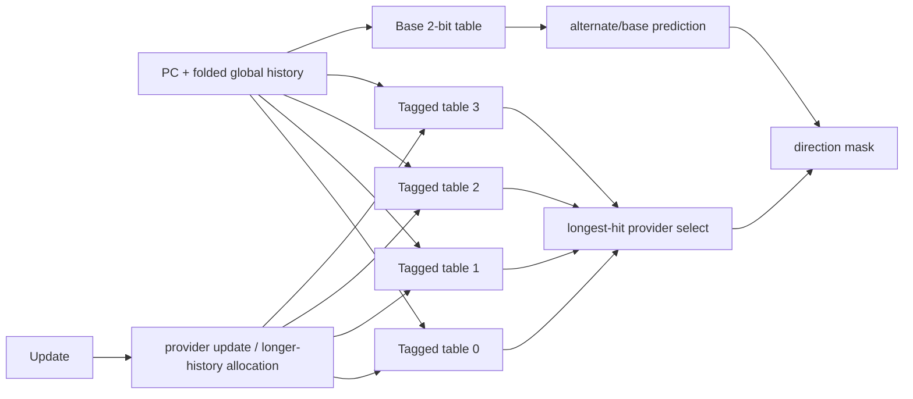

# Frontend TAGE

## Scope

- Source: OpenXiangShan/XiangShan `kunminghu-v2`, commit `52262f303fc06daf84cdab7011d59b7df65ce7e8`.
- Relative source file: `src/main/scala/xiangshan/frontend/Tage.scala`.
- Effective instantiation: `new Tage_SC`, which extends `Tage` and mixes in `HasSC` (`Tage.scala:1096`).

## Paper Context

The source acknowledges PPM-like/tagged branch prediction and TAGE/L-TAGE papers (`Tage.scala:17-26`). MCP search also found Seznec/Michaud TAGE-related papers including `A new case for the TAGE branch predictor` and `Storage free confidence estimation for the TAGE branch predictor`. The paper principle is tagged geometric history: multiple tables indexed by different folded global-history lengths compete; the longest matching tagged table is the provider, and shorter/base prediction is the alternate.

## Source Evidence

| Topic | Source lines | Core code | What it proves |
| --- | --- | --- | --- |
| Table params | `Tage.scala:42-71`, `Parameters.scala:106-111` | table infos, counter width, use-alt counters | Four tagged tables, 3-bit counters, use-alt-on-NA state. |
| Base table | `Tage.scala:143-270` | `TageBTable`, 2-bit counters | Built-in bimodal/base predictor for TAGE, separate from commented `Bim.scala`. |
| Tag/index hash | `Tage.scala:311-325`, `338-340` | folded history XOR PC | Per-table folded-history index/tag. |
| Tagged SRAM | `Tage.scala:345-421` | `valid/tag/ctr` + useful SRAM | Each table stores tag, 3-bit counter, useful bit. |
| Provider select | `Tage.scala:778-837` | `ParallelPriorityMux(inputRes.reverse)` | Longest matching table wins; base is alternate. |
| Allocation mask | `Tage.scala:813-823` | miss and useless entries longer than provider | Allocation candidates are longer-history useless entries. |
| Update/allocation | `Tage.scala:849-971` | provider update, use-alt update, allocate, reset-u tick | Training behavior. |
| Table write | `Tage.scala:982-1006` | registered update into each table/base table | Writes are staged and can block reads. |

## Lookup Algorithm

Each tagged table computes `unhashed_idx = pc >> instOffsetBits` (`Tage.scala:338-340`). It folds global history for index and tag, then computes `idx = unhashed_idx ^ idx_fh` and `tag = unhashed_idx ^ tag_fh ^ (alt_tag_fh << 1)` (`Tage.scala:317-325`). SRAM banks are selected by low index bits (`Tage.scala:304-307`, `375-381`). Returned entries hit when tag matches, valid is set, and no same-bank write invalidates the response (`Tage.scala:391-405`).

For each branch slot, physical branch index is unshuffled from low index bits (`Tage.scala:65-69`, `407-414`). Provider selection reverses table order before priority selection (`Tage.scala:782-793`), so longer history tables have priority. If no provider exists, or provider is weak and use-alt-on-NA says to use alternate, TAGE uses base table prediction (`Tage.scala:825-837`).

## Update Algorithm

At update, only committed valid branch slots that are not strong-bias and not after the first taken branch train (`Tage.scala:750-753`). A provider is updated with the resolved outcome and useful bit when it exists (`Tage.scala:904-912`). The base table updates when the alternate/base prediction was used (`Tage.scala:915-918`, `999-1002`).

On misprediction, TAGE allocates a longer-history table entry unless the alternate was used and the provider was actually correct (`Tage.scala:920-965`). Candidate allocation mask removes tables no longer than the provider and prefers entries that missed and have `u=0` (`Tage.scala:920-938`). An LFSR masks the candidate set; if the masked candidate is invalid, the first candidate is used (`Tage.scala:936-938`). Tick counters age/reset useful bits when allocation pressure saturates (`Tage.scala:940-971`).

## Algorithm Example Walkthrough

Example input: branch slot 0 at fetch PC `0x8000_3000`, global history folded values already computed by BPU. Assume table 0 misses, table 1 hits with counter `3'b011` (weak not-taken), table 2 hits with counter `3'b101` (taken), table 3 misses, and the base table counter is `2'b01` (not taken).

1. Index/tag hash: each `TageTable` uses `unhashed_idx = pc >> instOffsetBits` (`Tage.scala:338-340`) and `compute_tag_and_hash`, where index is `unhashed_idx ^ idx_fh` and tag is `unhashed_idx ^ tag_fh ^ (alt_tag_fh << 1)` (`Tage.scala:317-325`).
2. Table response: the table read returns a hit when `entry.tag === s1_tag && entry.valid && !resp_invalid_by_write` (`Tage.scala:395-421`). In this example, tables 1 and 2 are valid providers.
3. Provider select: `Tage.scala:782-793` reverses table order before `ParallelPriorityMux`, so table 2 wins over table 1 as the longer-history provider. `s1_providers(0)=2`, `s1_providerResps(0).ctr=3'b101`.
4. Alternate/base decision: `Tage.scala:779-837` uses `useAltOnNa` only if the provider is unconfident. Here `3'b101` is not one of the weak center states defined by `posUnconf/negUnconf` (`Tage.scala:60-63`), so `s1_altUsed(0)=false` and the prediction is taken from provider MSB `1`.
5. Output: `Tage.scala:841-846` writes `fp.br_taken_mask(0) := s2_tageTakens(0)` when `tage_enable` is true. The branch is predicted taken in S2.
6. Training: if backend later resolves not-taken, `updateMispred` is true. `Tage.scala:904-912` updates the provider counter toward not-taken; `Tage.scala:920-965` may allocate a longer-history table entry if allocation candidates exist. Candidate choice uses `allocatableMask`, LFSR masking, and first-entry fallback (`Tage.scala:920-938`).

Downstream effect: the example changes `br_taken_mask(0)` in S2 and records provider/counter/allocation metadata in `TageMeta` (`Tage.scala:119-136`, `804-823`) so FTQ update can train exactly the table that supplied the prediction.

## Stage-by-Stage Algorithm

| Stage | Inputs | Algorithm and state | Ready/stall | Output | Source lines |
| --- | --- | --- | --- | --- | --- |
| S0 table request | `s0_pc_dup(1)`, folded history, global history | Each tagged table computes folded-history index/tag and issues banked SRAM read; base table computes bimodal index/bank. | `io.s1_ready` is all table ready and base ready. | Tagged-table and base-table read requests. | `Tage.scala:317-381`, `638-655`, `1004-1006` |
| S1 table response | SRAM responses | Per branch slot, unshuffle physical branch index, compare tags/valids, read useful bits and counters. | Write conflict can invalidate response or deassert ready. | `s1_resps`, base counters. | `Tage.scala:391-421`, `667-685` |
| S1 provider select | table hit vectors and base counters | Reverse table order and choose longest provider; decide use-alt-on-NA; compute `s1_tageTakens`. | None local. | Provider/counter/alt/base state. | `Tage.scala:778-837` |
| S2 prediction | registered S1 provider decision | If `tage_enable`, write `fp.br_taken_mask(i)` for each branch slot. | Can cause BPU S2 override if different from S1. | S2 direction prediction and metadata. | `Tage.scala:687-699`, `841-846` |
| S3 metadata | S2 provider/base/allocation info | Register provider, response, base counters, allocation masks, use-alt metadata. | None local. | `last_stage_meta` for FTQ update. | `Tage.scala:804-823`, `838-840` |
| Update | FTQ update and saved `TageMeta` | Update provider counter/useful bit; update base when alternate used; allocate longer-history entries on mispred; reset useful on pressure. | Writes can block future table reads through single-port SRAM readiness. | Updated tagged tables and base table. | `Tage.scala:703-760`, `849-1006` |

## Redirect Signal Generation

TAGE does not directly assert a redirect wire; it changes S2 direction prediction, and BPU generates redirect if that differs from earlier S1 prediction.

| Redirect influence | Condition | Stage | BPU generation | Source lines |
| --- | --- | --- | --- | --- |
| Direction override versus S1 | `tage_enable` and `s2_tageTakens` differs from upstream S1 `br_taken_mask`. | S2 | `takenDiff` in `preds_needs_redirect_vec_dup` asserts `s2_redirect`. | `Tage.scala:841-846`, `frontend/BPU.scala:620-635`, `698-705` |
| CFI index/last branch position change | Direction changes which branch slot is first taken. | S2 | `lastBrPosOHDiff` or `takenOffsetDiff`. | `frontend/BPU.scala:620-635` |
| Update-induced later behavior | Mispred trains provider/base/allocates tables. | Update | No immediate redirect; changes future predictions. | `Tage.scala:904-1006` |
| Ready stall, not redirect | Table write/read conflict makes `io.s1_ready=false`. | S0/S1 | Composer/BPU stalls instead of redirecting. | `Tage.scala:1004-1006`, `frontend/Composer.scala:64-68` |

Example: if FauFTB/FTB upstream predicts branch slot 0 not-taken but TAGE provider counter MSB is taken, `Tage.scala:841-846` changes `br_taken_mask(0)` in S2. BPU detects `takenDiff` and asserts S2 redirect, updating target/history from the S2 prediction.

## Predictor Relationship

The effective Kunminghu frontend predictor chain is not a set of independent predictors voting in parallel. `Parameters.scala:124-143` constructs `FauFTB`, `Tage_SC`, `FTB`, `ITTage`, and `RAS`, connects them as `resp_in -> uftb -> tage -> ftb -> ittage -> ras`, and returns `ras.io.out` as the final composed prediction. `Bim.scala` is not part of this chain in this commit; its effective role is replaced by the `TageBTable` base table inside `Tage.scala:143-270`.

| Component | Relationship to the chain | What it contributes | How disagreement is handled | Source lines |
| --- | --- | --- | --- | --- |
| `BPU` / `Predictor` | Owns the pipeline, history state, redirect generators, and FTQ response. It does not compute every prediction locally; it drives `Composer`. | Shared PC/history inputs, stage fire/ready, global-history/folded-history repair, and final `io.bpu_to_ftq.resp`. | Compares later-stage composed predictions against earlier predictions and emits S2/S3/backend redirects. | `frontend/BPU.scala:381-455`, `606-635`, `698-725`, `827-854`, `915-1050` |
| `Composer` | Broadcasts common inputs/control to every component and gathers the final response from the configured chain. | Shared `s0_pc`, folded history, global history, stage fires, redirect, control, update, and concatenated `last_stage_meta`. | All components see the same redirect/update event; `io.in.ready` is the AND of component readiness, so one blocked predictor stalls the chain. | `frontend/Composer.scala:22-77` |
| `FauFTB` / uFTB | First and fast predictor in the chain. Its output feeds `Tage_SC`, and its entry/hit information also feeds `FTB`. | Early target/fall-through/entry information for fast S1 prediction. | Later `FTB`/`Tage`/`ITTAGE`/`RAS` output can refine it; BPU turns the difference into S2/S3 redirect. | `Parameters.scala:127-139`, `frontend/Composer.scala:25-31`, `frontend/FauFTB.scala:76-128` |
| `Tage_SC` | Receives uFTB output, then updates conditional branch direction before FTB/ITTAGE/RAS see the prediction. | TAGE direction plus SC correction over the base table and tagged tables. | If direction or first-taken branch differs from the fast prediction, BPU S2 comparison observes `takenDiff`/`lastBrPosOHDiff`. | `Parameters.scala:128-140`, `frontend/Tage.scala:778-846`, `frontend/SC.scala:259-372` |
| `FTB` | Receives TAGE-refined prediction and uFTB cached entry/hit information. | Direct branch/JAL target entries, branch-slot metadata, fall-through, multi-hit detection. | Target, CFI slot, fall-through, or multi-hit differences become S2/S3 redirect causes. | `Parameters.scala:126-138`, `frontend/FTB.scala:683-811`, `frontend/BPU.scala:827-854` |
| `ITTAGE` | Receives FTB output and specializes the JALR/indirect target path. | Indirect target override and ITTAGE metadata for later training. | If the indirect target changes after earlier stages, BPU observes target/JALR target differences and redirects. | `Parameters.scala:130-141`, `frontend/ITTAGE.scala:418-470`, `frontend/BPU.scala:827-854` |
| `RAS` / `newRAS` | Last component in the chain and therefore the final returned response. | Return target prediction, speculative stack pointer/top metadata, cancel/recovery behavior. | RAS target or cancel effects are reflected in final S3 prediction; backend redirect repairs RAS/history state through shared redirect/update paths. | `Parameters.scala:129-143`, `frontend/newRAS.scala:696-706`, `frontend/Composer.scala:37-56` |

Metadata and training are also chained. `Composer` concatenates each component's `last_stage_meta` in chain order (`frontend/Composer.scala:58-70`), FTQ stores that combined metadata (`frontend/NewFtq.scala:637`), and update walks components in reverse order to split the metadata back to each predictor (`frontend/Composer.scala:72-77`). This means a single FTQ update can train TAGE counters, FTB entries, ITTAGE target entries, and RAS state with the metadata each component produced during prediction.

Cross-predictor example: suppose uFTB predicts fall-through for PC `0x8000_1000`, but TAGE later marks branch slot 0 taken and FTB supplies target `0x8000_1080`. The chain first carries the uFTB result into `Tage_SC` and `FTB` (`Parameters.scala:136-140`). BPU records the earlier S1 prediction, compares it with the richer S2 composed response, and detects direction/target/CFI-index differences (`frontend/BPU.scala:606-635`, `698-705`). It then registers the S2 target, folded history, and global-history pointer into the next-PC/history generators (`frontend/BPU.scala:707-725`). If an even later RAS or ITTAGE target differs in S3, the S3 comparison checks branch-taken mask, target, JALR target, fall-through error, and FTB multi-hit before generating `s3_redirect` (`frontend/BPU.scala:827-854`).

## Scenarios

| Scenario | Trigger | Code | Result |
| --- | --- | --- | --- |
| Long-history hit | Multiple tables hit | `Tage.scala:782-793` | Highest/longest provider wins. |
| Weak provider | provider counter is unconfident and use-alt MSB set | `Tage.scala:779-837` | Base/alternate prediction used. |
| Bank write conflict | Read targets bank with write | `Tage.scala:391-405`, `470-474` | Response invalid or component not ready. |
| Mispred allocation | `updateMispred` and allocation candidates exist | `Tage.scala:920-965` | Allocate longer-history entry, `u=false`. |
| Useful aging | allocation pressure saturates tick counter | `Tage.scala:966-970` | reset useful bits for that branch bank. |

## Diagram

