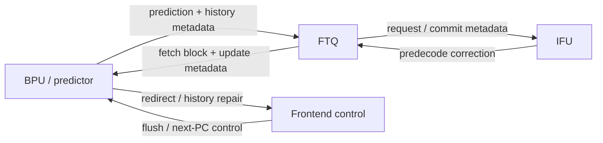
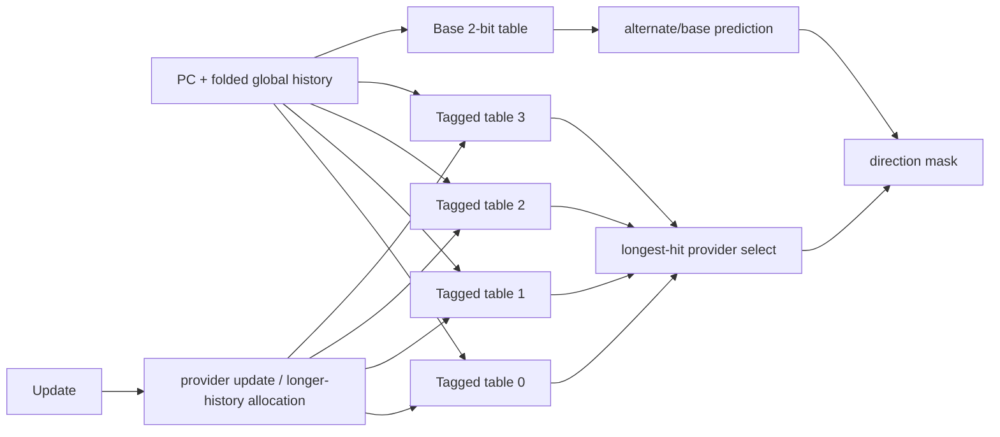

# Frontend Tage 分支预测器深入分析

<!-- regenerated-by-analyze-xiangshan-kunminghu -->
> Regenerated from `OpenXiangShan/XiangShan` branch `kunminghu-v2`, source commit `52262f303fc06daf84cdab7011d59b7df65ce7e8` using the updated Frontend graph/stage rules.


> 官方源码：`https://github.com/OpenXiangShan/XiangShan.git`；分支 `kunminghu-v2`；分析 commit `52262f303fc06daf84cdab7011d59b7df65ce7e8`。论文解释算法原理，源码决定香山的有效参数、流水、更新与恢复。

<!-- frontend-tutorial-generated-by-analyze-xiangshan-kunminghu -->
> 本文按 `Mem-MDP.md` 的统一目录组织为教程：先建立模块边界，再阅读源码证据、动态路径、算法、状态、跨边界行为和验证方法。
> 所有实现结论均限定在 `kunminghu-v2` commit `52262f303fc06daf84cdab7011d59b7df65ce7e8`；Design Doc 结论必须回到第 18 节的源码追溯矩阵。

## 1. Scope

本节保留模块职责、分析基线、范围和统一五问，明确本文只以当前源码证据为准。

### 1.1. 统一五问导读
| 问题 | 回答 |
| --- | --- |
| **Who** | `Tage` 负责条件分支方向，是 `Tage_SC` 的主预测器；`TageBTable` 提供基础方向。 |
| **What** | 多张 tag 表使用几何增长的历史长度，最长匹配表捕获长相关，短表/基表提供 alternate。 |
| **How** | 折叠历史生成 index/tag；选择 provider/alternate；根据 ctr、useAltOnNa 和 useful bit 得到方向；误预测时在更长表分配。 |
| **From what** | PC、全局历史及 folded history 来自 BPU；真实方向、旧 meta 和分配信息来自 FTQ commit update。 |
| **To what** | 输出条件分支 taken mask 给 SC/FTB；方向改变由 BPU 转成 S2 redirect。 |

### 1.2. 分析范围
- Source: OpenXiangShan/XiangShan `kunminghu-v2`, commit `52262f303fc06daf84cdab7011d59b7df65ce7e8`.
- Relative source file: [src/main/scala/xiangshan/frontend/Tage.scala](https://github.com/OpenXiangShan/XiangShan/blob/kunminghu-v2/src/main/scala/xiangshan/frontend/Tage.scala).
- Effective instantiation: `new Tage_SC`, which extends `Tage` and mixes in `HasSC` ([Tage.scala:1096](https://github.com/OpenXiangShan/XiangShan/blob/kunminghu-v2/src/main/scala/xiangshan/frontend/Tage.scala#L1096)).

## 2. 关键源码证据

本节直接列出 `TAGE` 的有效源码入口、关键代码骨架和行为解释，避免只保存文件名或行号。

### 2.1. 源码入口和行号
| 源码文件 | 本文使用它证明什么 | 行号证据 |
| --- | --- | --- |
| `frontend/Tage.scala` | base table、tagged tables、provider/alternate、预测输出 | [frontend/Tage.scala#L143-L270](https://github.com/OpenXiangShan/XiangShan/blob/kunminghu-v2/src/main/scala/xiangshan/frontend/Tage.scala#L143-L270); [frontend/Tage.scala#L778-L846](https://github.com/OpenXiangShan/XiangShan/blob/kunminghu-v2/src/main/scala/xiangshan/frontend/Tage.scala#L778-L846) |
| `frontend/Tage.scala` | update/read 冲突 ready 控制 | [frontend/Tage.scala#L1004-L1006](https://github.com/OpenXiangShan/XiangShan/blob/kunminghu-v2/src/main/scala/xiangshan/frontend/Tage.scala#L1004-L1006) |
| `Parameters.scala` | `TageTableInfos` 历史长度和 tag 位宽 | [Parameters.scala#L124-L143](https://github.com/OpenXiangShan/XiangShan/blob/kunminghu-v2/src/main/scala/xiangshan/Parameters.scala#L124-L143) |

### 2.2. 核心代码骨架
```scala
val foldedHist = computeFoldedHistory(ghist, tableInfo.histLen)
val idx = hash(pc, foldedHist)
val tagMatch = entry.valid && entry.tag === tag
val provider = selectLongestHistoryHit(tagMatchVec)
val taken = provider.ctr.msb
```

### 2.3. 代码解析
TAGE 用多个历史长度递增的 tagged table 预测条件分支方向。最长历史命中的 provider 优先，alternate/base 用于低置信或训练场景。
## 3. Theory-to-Code Mapping

本节把理论概念直接绑定到 `TAGE` 的源码对象、控制/数据状态和下游消费者。

### 3.1. 理论到代码映射表
| 理论概念 | 代码对象 | 为什么需要它 | 消费者/后续影响 |
| --- | --- | --- | --- |
| 几何历史长度 | `TageTableInfos` histLen | 用短历史覆盖稳定模式，用长历史覆盖长相关 | provider 选择 |
| provider/alternate | tag hit vector、counter、useful bit | 命中多个表时选择最长有效历史 | SC、FTB 和 BPU 比较 |
| 训练与分配 | update meta、useful、counter saturation | 错误预测后修正计数器并可能分配长历史项 | FTQ update |

### 3.2. 阅读顺序
先按第 2 节定位源码对象，再顺着本表检查信号从哪里来、状态在哪里保存、何时更新、谁消费结果。若本篇只引用相邻模块拥有的状态，则以相邻 Frontend 分文档的源码分析为准。
## 4. 论文原则和有效代码


### 4.1. 状态机与论文理论
TAGE 是查询、provider 选择、SC 接续、update/allocation/aging 的隐式表项生命周期。Seznec 的 *A new case for the TAGE branch predictor*（DOI `10.1145/2155620.2155635`）说明 tagged geometric history：从短到长的历史表覆盖不同相关距离，tag 降低 alias，最长命中 provider 优先，alternate 用于新分配/低置信 provider。香山还实现 bank 化、折叠历史、useful 位和周期性清理。

### 4.2. 论文理论背景
The source acknowledges PPM-like/tagged branch prediction and TAGE/L-TAGE papers ([Tage.scala:17-26](https://github.com/OpenXiangShan/XiangShan/blob/kunminghu-v2/src/main/scala/xiangshan/frontend/Tage.scala#L17-L26)). MCP search also found Seznec/Michaud TAGE-related papers including `A new case for the TAGE branch predictor` and `Storage free confidence estimation for the TAGE branch predictor`. The paper principle is tagged geometric history: multiple tables indexed by different folded global-history lengths compete; the longest matching tagged table is the provider, and shorter/base prediction is the alternate.

### 4.3. 论文原理深入讲解
#### 4.3.1. 论文脉络

1. Pierre Michaud, *A PPM-like, tag-based branch predictor*（JILP 2005，HAL `hal-03406188`）把 PPM 的“最长上下文匹配”思想转化为带 tag 的硬件预测表。
2. André Seznec、Pierre Michaud, *A case for (partially) tagged geometric history length branch prediction*（JILP 2006，HAL `hal-03408381`）给出 TAGE：历史长度按几何级数增长，让有限表同时覆盖短期和长期相关性。
3. André Seznec, *A new case for the TAGE branch predictor*（MICRO 2011，DOI `10.1145/2155620.2155635`）进一步讨论 provider、alternate、置信度和分配策略。论文检索获得了题录和 DOI，但本次 MCP 未取得 ACM 全文；下面只总结稳定的算法原则，香山参数与时序严格以代码为准。

#### 4.3.2. 为什么需要几何历史

只用短历史，能学会循环和近邻分支相关，却无法区分“同一 PC 在很久以前不同路径下”的行为；只用长历史，又会造成索引空间稀疏、训练慢和 alias。TAGE 同时访问多张表，历史长度近似 `L_i = α^(i-1)L_1`。短表负责快速泛化，长表负责识别稀有但稳定的长上下文。香山用 PC 与 folded history 计算每张表的 index/tag（[frontend/Tage.scala:311-340](https://github.com/OpenXiangShan/XiangShan/blob/kunminghu-v2/src/main/scala/xiangshan/frontend/Tage.scala#L311-L340)），因此没有存储完整长历史也能并行查表。

#### 4.3.3. Provider、Alternate 与 Useful 的论文含义

- **Provider**：所有 tag 命中项中历史最长者，代表最具体上下文；香山的最长命中选择见 [frontend/Tage.scala:778-837](https://github.com/OpenXiangShan/XiangShan/blob/kunminghu-v2/src/main/scala/xiangshan/frontend/Tage.scala#L778-L837)。
- **Alternate**：次长命中项或 base bimodal。新 provider 的 counter 尚弱时，alternate 往往更可靠，因此 `use_alt_on_na` 学习是否信任备用预测。
- **Useful (`u`)**：衡量该 entry 是否曾经比 alternate 更有价值。分配时优先覆盖 `u=0` 项，容量压力过大时周期性衰减 useful，避免旧工作集永久占表（[frontend/Tage.scala:849-971](https://github.com/OpenXiangShan/XiangShan/blob/kunminghu-v2/src/main/scala/xiangshan/frontend/Tage.scala#L849-L971)）。

#### 4.3.4. 一次预测与训练示例

假设 PC `P` 同时命中 8-bit、32-bit 和 128-bit 历史表。128-bit 表是 provider，32-bit 表是 alternate。若 provider counter 处在弱 taken，而 alternate 强 not-taken，`use_alt_on_na` 可决定暂时采用 alternate。执行后若真实结果是 taken：provider counter 墝强；若 provider 正确且 alternate 错，provider 的 useful 增加。若最终仍误预测，则在 provider 之后、`u=0` 的更长历史候选中分配新 entry。这个过程对应香山的 provider/alternate 选择、allocation mask 和 update 流水（[frontend/Tage.scala:813-823](https://github.com/OpenXiangShan/XiangShan/blob/kunminghu-v2/src/main/scala/xiangshan/frontend/Tage.scala#L813-L823)，[frontend/Tage.scala:849-1006](https://github.com/OpenXiangShan/XiangShan/blob/kunminghu-v2/src/main/scala/xiangshan/frontend/Tage.scala#L849-L1006)）。

#### 4.3.5. 论文与香山实现不能混同的地方

论文定义算法族，不规定香山当前的表数、SRAM bank、分支槽 unshuffle、单端口冲突或 S2/S3 时序。香山使用四张 tagged 表、3-bit counter、独立 base table 和具体的读写旁路；这些都应以 `kunminghu-v2` 的参数与实现为准（[frontend/Tage.scala:42-71](https://github.com/OpenXiangShan/XiangShan/blob/kunminghu-v2/src/main/scala/xiangshan/frontend/Tage.scala#L42-L71)，[frontend/Tage.scala:143-270](https://github.com/OpenXiangShan/XiangShan/blob/kunminghu-v2/src/main/scala/xiangshan/frontend/Tage.scala#L143-L270)）。

## 5. Microarchitecture Parameters


### 5.1. 表容量、分配与边界
- TAGE 每张 tagged table 容量固定；allocation 只选择 provider 之后更长历史表中的可替换项，候选不足时不越界分配。
- useful bit 饱和并周期性清理，防止所有 entry 永久保持不可替换；方向计数器饱和，避免数值 overflow/underflow。
- 无 tagged provider 时回退 `TageBTable`；provider/alternate metadata valid 控制选择，不读取“空 provider”。

```waveform-draw
{
  "signal": [
    {
      "name": "clk",
      "wave": "p......."
    },
    {
      "name": "s0_valid",
      "wave": "01..0..."
    },
    {
      "name": "table_match",
      "wave": "0.1....."
    },
    {
      "name": "provider",
      "wave": "x..=x...",
      "data": [
        "T3"
      ]
    },
    {
      "name": "alternate",
      "wave": "x..=x...",
      "data": [
        "T1"
      ]
    },
    {
      "name": "s2_taken",
      "wave": "0...10.."
    },
    {
      "name": "update_alloc",
      "wave": "0......1"
    }
  ],
  "config": {
    "hscale": 1
  }
}
```

## 6. 模块边界和接口


### 6.1. 控制信号逐项解释：Who / From / To / How / Why
> 下表覆盖本文讲解中出现的查询、流水推进、选择、训练、替换和恢复控制。`为什么存在` 不以信号命名猜测，而以当前 `kunminghu-v2` 数据依赖、资源限制和恢复要求为依据。

| 控制信号 / 状态 | 谁产生 / 从哪里来 | 谁消费 / 到哪里去 | 何时、如何生效 | 为什么存在；缺失会怎样 | 代码证据 |
| --- | --- | --- | --- | --- | --- |
| `io.in.valid / stage fire` | uFTB/BPU 请求 | base table 与 tagged tables | 接受 PC、ghist、folded history 后启动并行查表。 | 多表必须对同一历史快照查询；fire 防止反压时部分表重复或错拍。 | [frontend/Tage.scala:778-846](https://github.com/OpenXiangShan/XiangShan/blob/kunminghu-v2/src/main/scala/xiangshan/frontend/Tage.scala#L778-L846) |
| `io.ctrl.tage_enable` | CSR/BPU 控制 | TAGE 输出 mux | 关闭时保留上游/base 行为。 | 允许独立验证、性能消融和故障旁路，避免异常表状态不可控地影响取指。 | [frontend/Tage.scala:778-846](https://github.com/OpenXiangShan/XiangShan/blob/kunminghu-v2/src/main/scala/xiangshan/frontend/Tage.scala#L778-L846) |
| `table_idx / table_tag` | PC 与各长度 folded history | 各 tagged SRAM | 不同历史长度生成不同索引和 tag。 | 几何历史依赖需要在有限位宽下压缩上下文；tag 用来辨别 index hash 冲突。 | [frontend/Tage.scala:311-340](https://github.com/OpenXiangShan/XiangShan/blob/kunminghu-v2/src/main/scala/xiangshan/frontend/Tage.scala#L311-L340) |
| `hits / provider_valid` | 各表 valid/tag 比较 | provider 优先选择 | 从最长历史命中表选 provider。 | 最长匹配上下文通常最专门；显式 valid 防止无命中时把随机 counter 当预测。 | [frontend/Tage.scala:778-837](https://github.com/OpenXiangShan/XiangShan/blob/kunminghu-v2/src/main/scala/xiangshan/frontend/Tage.scala#L778-L837) |
| `altpred` | 次长命中或 base table | 最终方向 mux | 提供 provider 之外的备用方向。 | 新分配 provider 训练样本少；alternate 保留成熟短历史/基础统计，降低冷启动误预测。 | [frontend/Tage.scala:778-837](https://github.com/OpenXiangShan/XiangShan/blob/kunminghu-v2/src/main/scala/xiangshan/frontend/Tage.scala#L778-L837) |
| `use_alt_on_na` | 按 PC 索引的学习 counter | provider/alternate 选择 | provider 未饱和/新分配时学习是否采用 alternate。 | 并非所有分支都适合立即相信长历史；该信号让选择策略按静态分支自适应。 | [frontend/Tage.scala:50-63](https://github.com/OpenXiangShan/XiangShan/blob/kunminghu-v2/src/main/scala/xiangshan/frontend/Tage.scala#L50-L63) |
| `provider.unconf` | provider counter 边界 | alternate 与 SC | 标记弱 taken/弱 not-taken。 | 方向位不能表达可信度；unconf 使后级知道哪些预测值得被 alternate/SC 修正。 | [frontend/Tage.scala:60-63](https://github.com/OpenXiangShan/XiangShan/blob/kunminghu-v2/src/main/scala/xiangshan/frontend/Tage.scala#L60-L63) |
| `allocates` | mispred、provider 位置和 u=0 候选 | 更长历史表写口 | 误预测时在 provider 之后选择可替换表分配。 | 当前历史长度无法区分模式时，需要更长上下文；限制为 u=0 防止驱逐仍有贡献项。 | [frontend/Tage.scala:813-823](https://github.com/OpenXiangShan/XiangShan/blob/kunminghu-v2/src/main/scala/xiangshan/frontend/Tage.scala#L813-L823) |
| `io.update.valid / update_mask` | FTQ 提交结果 | provider/base/use-alt/u-bit 训练 | 按真实结果和分支槽更新。 | 延迟训练必须精确对应原分支槽，避免同块其他分支或错误路径污染表。 | [frontend/Tage.scala:849-971](https://github.com/OpenXiangShan/XiangShan/blob/kunminghu-v2/src/main/scala/xiangshan/frontend/Tage.scala#L849-L971) |
| `tick / reset_u` | 分配成功/失败统计 | useful SRAM | 容量压力达到条件时分阶段清 useful bit。 | u 位若永久保持，旧工作集会锁死表；老化为新模式提供替换机会。 | [frontend/Tage.scala:849-971](https://github.com/OpenXiangShan/XiangShan/blob/kunminghu-v2/src/main/scala/xiangshan/frontend/Tage.scala#L849-L971) |
| `last_stage_meta` | base/provider/alternate/counter/u | FTQ 与更新流水 | 保存预测时选择和 counter 状态。 | 提交可能晚数百拍，届时表已被其他分支修改；metadata 保证训练归因到原预测。 | [frontend/Tage.scala:778-846](https://github.com/OpenXiangShan/XiangShan/blob/kunminghu-v2/src/main/scala/xiangshan/frontend/Tage.scala#L778-L846) |

#### 6.1.1. Top-Level Module Connectivity

This module participates in the predictor chain, but the top-level graph keeps only bundled interfaces. `Frontend.scala` instantiates BPU, FTQ, IFU, IBuffer, ICache, and InstrUncache, while the predictor-specific chain is configured through Composer: [frontend/Frontend.scala:103-109](https://github.com/OpenXiangShan/XiangShan/blob/52262f303fc06daf84cdab7011d59b7df65ce7e8/src/main/scala/xiangshan/frontend/Frontend.scala#L103-L109), [frontend/Composer.scala:22-77](https://github.com/OpenXiangShan/XiangShan/blob/52262f303fc06daf84cdab7011d59b7df65ce7e8/src/main/scala/xiangshan/frontend/Composer.scala#L22-L77).



No module pair has more than three bundled edges. Individual table reads, counters, folded histories, and predictor-local states remain in the module's detailed sections instead of becoming separate graph lines.

#### 6.1.2. Frontend/Backend Pipeline Stages

The source-proven stage boundary is `F0 -> F1 -> F2 -> F3`: F0 accepts the FTQ request and calculates line indices, F1 registers the fetch block and calculates instruction PCs/cut pointers, F2 waits for ICache responses and performs data cutting/predecode preparation, and F3 expands/qualifies instructions, handles exceptions/MMIO, and drives IBuffer. Evidence: [frontend/IFU.scala:236-305](https://github.com/OpenXiangShan/XiangShan/blob/52262f303fc06daf84cdab7011d59b7df65ce7e8/src/main/scala/xiangshan/frontend/IFU.scala#L236-L305), [frontend/IFU.scala:346-457](https://github.com/OpenXiangShan/XiangShan/blob/52262f303fc06daf84cdab7011d59b7df65ce7e8/src/main/scala/xiangshan/frontend/IFU.scala#L346-L457), [frontend/IFU.scala:542-617](https://github.com/OpenXiangShan/XiangShan/blob/52262f303fc06daf84cdab7011d59b7df65ce7e8/src/main/scala/xiangshan/frontend/IFU.scala#L542-L617). The top-level connections couple FTQ, IFU, ICache, and IBuffer through shared ready/valid conditions: [frontend/Frontend.scala:199-231](https://github.com/OpenXiangShan/XiangShan/blob/52262f303fc06daf84cdab7011d59b7df65ce7e8/src/main/scala/xiangshan/frontend/Frontend.scala#L199-L231).

The backend continuation uses the effective module boundaries rather than inventing cycle names: Decode accepts the instruction packet, Rename creates speculative physical-register mappings, Dispatch allocates downstream resources, Issue/Scheduler selects ready uops, Execute/FU produces results, DataPath/WB carries writeback and wakeup, and ROB/CtrlBlock commits or redirects. Evidence: [backend/decode/DecodeStage.scala:83-120](https://github.com/OpenXiangShan/XiangShan/blob/52262f303fc06daf84cdab7011d59b7df65ce7e8/src/main/scala/xiangshan/backend/decode/DecodeStage.scala#L83-L120), [backend/rename/Rename.scala:40-117](https://github.com/OpenXiangShan/XiangShan/blob/52262f303fc06daf84cdab7011d59b7df65ce7e8/src/main/scala/xiangshan/backend/rename/Rename.scala#L40-L117), [backend/dispatch/NewDispatch.scala:49-176](https://github.com/OpenXiangShan/XiangShan/blob/52262f303fc06daf84cdab7011d59b7df65ce7e8/src/main/scala/xiangshan/backend/dispatch/NewDispatch.scala#L49-L176), [backend/issue/Scheduler.scala:29-180](https://github.com/OpenXiangShan/XiangShan/blob/52262f303fc06daf84cdab7011d59b7df65ce7e8/src/main/scala/xiangshan/backend/issue/Scheduler.scala#L29-L180), [backend/exu/ExeUnit.scala:50-110](https://github.com/OpenXiangShan/XiangShan/blob/52262f303fc06daf84cdab7011d59b7df65ce7e8/src/main/scala/xiangshan/backend/exu/ExeUnit.scala#L50-L110), [backend/datapath/DataPath.scala:25-70](https://github.com/OpenXiangShan/XiangShan/blob/52262f303fc06daf84cdab7011d59b7df65ce7e8/src/main/scala/xiangshan/backend/datapath/DataPath.scala#L25-L70), [backend/rob/Rob.scala:52-145](https://github.com/OpenXiangShan/XiangShan/blob/52262f303fc06daf84cdab7011d59b7df65ce7e8/src/main/scala/xiangshan/backend/rob/Rob.scala#L52-L145), [backend/CtrlBlock.scala:50-110](https://github.com/OpenXiangShan/XiangShan/blob/52262f303fc06daf84cdab7011d59b7df65ce7e8/src/main/scala/xiangshan/backend/CtrlBlock.scala#L50-L110).

```mermaid
flowchart LR
  F0["F0: FTQ req + line indices"] -->|f0_fire| F1["F1: PC + cut pointers"]
  F1 -->|f1_fire| F2["F2: ICache data + exceptions"]
  F2 -->|f2_fire| F3["F3: predecode + MMIO qualification"]
  F3 -->|toIbuffer.fire| Decode["Decode"]
  Decode -->|uop bundle| Rename["Rename"]
  Rename -->|renamed uop| Dispatch["Dispatch"]
  Dispatch -->|ready uop| Issue["Issue"]
  Issue -->|operands| Execute["Execute/FU"]
  Execute -->|result| Writeback["Writeback/Wakeup"]
  Writeback -->|retire candidate| Commit["ROB/Commit"]
  Commit -->|redirect/flush| F0
```



The stage graph keeps chronological forward edges separate from the bundled recovery edge. It must be read together with the module graph below: a stage is not itself a module, and a redirect does not create a fake forward stage.

```waveform-draw
{
  "signal": [
    {
      "name": "clk",
      "wave": "p......."
    },
    {
      "name": "F0.valid",
      "wave": "01...0.."
    },
    {
      "name": "F0.ready",
      "wave": "1..0...."
    },
    {
      "name": "F1.valid",
      "wave": "001..0.."
    },
    {
      "name": "F2.valid",
      "wave": "0001.0.."
    },
    {
      "name": "F3.valid",
      "wave": "00001.0."
    },
    {
      "name": "toIbuffer.fire",
      "wave": "0000010."
    },
    {
      "name": "redirect/flush",
      "wave": "00000010"
    }
  ],
  "config": {
    "hscale": 1
  }
}
```

## 7. 为什么模块存在


把模块放回 Frontend 全链路理解：它解决的是预测带宽、取指正确性、存储层次延迟、投机恢复或上下游速率不匹配中的至少一个问题。

## 8. 有效动态路径


### 8.1. Lookup Algorithm
Each tagged table computes `unhashed_idx = pc >> instOffsetBits` ([Tage.scala:338-340](https://github.com/OpenXiangShan/XiangShan/blob/kunminghu-v2/src/main/scala/xiangshan/frontend/Tage.scala#L338-L340)). It folds global history for index and tag, then computes `idx = unhashed_idx ^ idx_fh` and `tag = unhashed_idx ^ tag_fh ^ (alt_tag_fh << 1)` ([Tage.scala:317-325](https://github.com/OpenXiangShan/XiangShan/blob/kunminghu-v2/src/main/scala/xiangshan/frontend/Tage.scala#L317-L325)). SRAM banks are selected by low index bits ([Tage.scala:304-307](https://github.com/OpenXiangShan/XiangShan/blob/kunminghu-v2/src/main/scala/xiangshan/frontend/Tage.scala#L304-L307), [Tage.scala:375-381](https://github.com/OpenXiangShan/XiangShan/blob/kunminghu-v2/src/main/scala/xiangshan/frontend/Tage.scala#L375-L381)). Returned entries hit when tag matches, valid is set, and no same-bank write invalidates the response ([Tage.scala:391-405](https://github.com/OpenXiangShan/XiangShan/blob/kunminghu-v2/src/main/scala/xiangshan/frontend/Tage.scala#L391-L405)).

For each branch slot, physical branch index is unshuffled from low index bits ([Tage.scala:65-69](https://github.com/OpenXiangShan/XiangShan/blob/kunminghu-v2/src/main/scala/xiangshan/frontend/Tage.scala#L65-L69), [Tage.scala:407-414](https://github.com/OpenXiangShan/XiangShan/blob/kunminghu-v2/src/main/scala/xiangshan/frontend/Tage.scala#L407-L414)). Provider selection reverses table order before priority selection ([Tage.scala:782-793](https://github.com/OpenXiangShan/XiangShan/blob/kunminghu-v2/src/main/scala/xiangshan/frontend/Tage.scala#L782-L793)), so longer history tables have priority. If no provider exists, or provider is weak and use-alt-on-NA says to use alternate, TAGE uses base table prediction ([Tage.scala:825-837](https://github.com/OpenXiangShan/XiangShan/blob/kunminghu-v2/src/main/scala/xiangshan/frontend/Tage.scala#L825-L837)).

### 8.2. Update Algorithm
At update, only committed valid branch slots that are not strong-bias and not after the first taken branch train ([Tage.scala:750-753](https://github.com/OpenXiangShan/XiangShan/blob/kunminghu-v2/src/main/scala/xiangshan/frontend/Tage.scala#L750-L753)). A provider is updated with the resolved outcome and useful bit when it exists ([Tage.scala:904-912](https://github.com/OpenXiangShan/XiangShan/blob/kunminghu-v2/src/main/scala/xiangshan/frontend/Tage.scala#L904-L912)). The base table updates when the alternate/base prediction was used ([Tage.scala:915-918](https://github.com/OpenXiangShan/XiangShan/blob/kunminghu-v2/src/main/scala/xiangshan/frontend/Tage.scala#L915-L918), [Tage.scala:999-1002](https://github.com/OpenXiangShan/XiangShan/blob/kunminghu-v2/src/main/scala/xiangshan/frontend/Tage.scala#L999-L1002)).

On misprediction, TAGE allocates a longer-history table entry unless the alternate was used and the provider was actually correct ([Tage.scala:920-965](https://github.com/OpenXiangShan/XiangShan/blob/kunminghu-v2/src/main/scala/xiangshan/frontend/Tage.scala#L920-L965)). Candidate allocation mask removes tables no longer than the provider and prefers entries that missed and have `u=0` ([Tage.scala:920-938](https://github.com/OpenXiangShan/XiangShan/blob/kunminghu-v2/src/main/scala/xiangshan/frontend/Tage.scala#L920-L938)). An LFSR masks the candidate set; if the masked candidate is invalid, the first candidate is used ([Tage.scala:936-938](https://github.com/OpenXiangShan/XiangShan/blob/kunminghu-v2/src/main/scala/xiangshan/frontend/Tage.scala#L936-L938)). Tick counters age/reset useful bits when allocation pressure saturates ([Tage.scala:940-971](https://github.com/OpenXiangShan/XiangShan/blob/kunminghu-v2/src/main/scala/xiangshan/frontend/Tage.scala#L940-L971)).

## 9. Index 和地址/历史计算


地址、PC、折叠历史、tag、set/way、line offset 和 FTQ offset 都必须追到源码表达式；索引冲突、回绕和跨边界情况在算法和验证章节中继续展开。

## 10. 核心算法


### 10.1. 算法示例推演
Example input: branch slot 0 at fetch PC `0x8000_3000`, global history folded values already computed by BPU. Assume table 0 misses, table 1 hits with counter `3'b011` (weak not-taken), table 2 hits with counter `3'b101` (taken), table 3 misses, and the base table counter is `2'b01` (not taken).

1. Index/tag hash: each `TageTable` uses `unhashed_idx = pc >> instOffsetBits` ([Tage.scala:338-340](https://github.com/OpenXiangShan/XiangShan/blob/kunminghu-v2/src/main/scala/xiangshan/frontend/Tage.scala#L338-L340)) and `compute_tag_and_hash`, where index is `unhashed_idx ^ idx_fh` and tag is `unhashed_idx ^ tag_fh ^ (alt_tag_fh << 1)` ([Tage.scala:317-325](https://github.com/OpenXiangShan/XiangShan/blob/kunminghu-v2/src/main/scala/xiangshan/frontend/Tage.scala#L317-L325)).
2. Table response: the table read returns a hit when `entry.tag === s1_tag && entry.valid && !resp_invalid_by_write` ([Tage.scala:395-421](https://github.com/OpenXiangShan/XiangShan/blob/kunminghu-v2/src/main/scala/xiangshan/frontend/Tage.scala#L395-L421)). In this example, tables 1 and 2 are valid providers.
3. Provider select: [Tage.scala:782-793](https://github.com/OpenXiangShan/XiangShan/blob/kunminghu-v2/src/main/scala/xiangshan/frontend/Tage.scala#L782-L793) reverses table order before `ParallelPriorityMux`, so table 2 wins over table 1 as the longer-history provider. `s1_providers(0)=2`, `s1_providerResps(0).ctr=3'b101`.
4. Alternate/base decision: [Tage.scala:779-837](https://github.com/OpenXiangShan/XiangShan/blob/kunminghu-v2/src/main/scala/xiangshan/frontend/Tage.scala#L779-L837) uses `useAltOnNa` only if the provider is unconfident. Here `3'b101` is not one of the weak center states defined by `posUnconf/negUnconf` ([Tage.scala:60-63](https://github.com/OpenXiangShan/XiangShan/blob/kunminghu-v2/src/main/scala/xiangshan/frontend/Tage.scala#L60-L63)), so `s1_altUsed(0)=false` and the prediction is taken from provider MSB [Tage.scala:1](https://github.com/OpenXiangShan/XiangShan/blob/kunminghu-v2/src/main/scala/xiangshan/frontend/Tage.scala#L1).
5. Output: [Tage.scala:841-846](https://github.com/OpenXiangShan/XiangShan/blob/kunminghu-v2/src/main/scala/xiangshan/frontend/Tage.scala#L841-L846) writes `fp.br_taken_mask(0) := s2_tageTakens(0)` when `tage_enable` is true. The branch is predicted taken in S2.
6. Training: if backend later resolves not-taken, `updateMispred` is true. [Tage.scala:904-912](https://github.com/OpenXiangShan/XiangShan/blob/kunminghu-v2/src/main/scala/xiangshan/frontend/Tage.scala#L904-L912) updates the provider counter toward not-taken; [Tage.scala:920-965](https://github.com/OpenXiangShan/XiangShan/blob/kunminghu-v2/src/main/scala/xiangshan/frontend/Tage.scala#L920-L965) may allocate a longer-history table entry if allocation candidates exist. Candidate choice uses `allocatableMask`, LFSR masking, and first-entry fallback ([Tage.scala:920-938](https://github.com/OpenXiangShan/XiangShan/blob/kunminghu-v2/src/main/scala/xiangshan/frontend/Tage.scala#L920-L938)).

Downstream effect: the example changes `br_taken_mask(0)` in S2 and records provider/counter/allocation metadata in `TageMeta` ([Tage.scala:119-136](https://github.com/OpenXiangShan/XiangShan/blob/kunminghu-v2/src/main/scala/xiangshan/frontend/Tage.scala#L119-L136), [Tage.scala:804-823](https://github.com/OpenXiangShan/XiangShan/blob/kunminghu-v2/src/main/scala/xiangshan/frontend/Tage.scala#L804-L823)) so FTQ update can train exactly the table that supplied the prediction.

### 10.2. 逐流水级算法
| Stage | Inputs | Algorithm and state | Ready/stall | Output | Source lines |
| --- | --- | --- | --- | --- | --- |
| S0 table request | `s0_pc_dup(1)`, folded history, global history | Each tagged table computes folded-history index/tag and issues banked SRAM read; base table computes bimodal index/bank. | `io.s1_ready` is all table ready and base ready. | Tagged-table and base-table read requests. | [Tage.scala:317-381](https://github.com/OpenXiangShan/XiangShan/blob/kunminghu-v2/src/main/scala/xiangshan/frontend/Tage.scala#L317-L381), [Tage.scala:638-655](https://github.com/OpenXiangShan/XiangShan/blob/kunminghu-v2/src/main/scala/xiangshan/frontend/Tage.scala#L638-L655), [Tage.scala:1004-1006](https://github.com/OpenXiangShan/XiangShan/blob/kunminghu-v2/src/main/scala/xiangshan/frontend/Tage.scala#L1004-L1006) |
| S1 table response | SRAM responses | Per branch slot, unshuffle physical branch index, compare tags/valids, read useful bits and counters. | Write conflict can invalidate response or deassert ready. | `s1_resps`, base counters. | [Tage.scala:391-421](https://github.com/OpenXiangShan/XiangShan/blob/kunminghu-v2/src/main/scala/xiangshan/frontend/Tage.scala#L391-L421), [Tage.scala:667-685](https://github.com/OpenXiangShan/XiangShan/blob/kunminghu-v2/src/main/scala/xiangshan/frontend/Tage.scala#L667-L685) |
| S1 provider select | table hit vectors and base counters | Reverse table order and choose longest provider; decide use-alt-on-NA; compute `s1_tageTakens`. | None local. | Provider/counter/alt/base state. | [Tage.scala:778-837](https://github.com/OpenXiangShan/XiangShan/blob/kunminghu-v2/src/main/scala/xiangshan/frontend/Tage.scala#L778-L837) |
| S2 prediction | registered S1 provider decision | If `tage_enable`, write `fp.br_taken_mask(i)` for each branch slot. | Can cause BPU S2 override if different from S1. | S2 direction prediction and metadata. | [Tage.scala:687-699](https://github.com/OpenXiangShan/XiangShan/blob/kunminghu-v2/src/main/scala/xiangshan/frontend/Tage.scala#L687-L699), [Tage.scala:841-846](https://github.com/OpenXiangShan/XiangShan/blob/kunminghu-v2/src/main/scala/xiangshan/frontend/Tage.scala#L841-L846) |
| S3 metadata | S2 provider/base/allocation info | Register provider, response, base counters, allocation masks, use-alt metadata. | None local. | `last_stage_meta` for FTQ update. | [Tage.scala:804-823](https://github.com/OpenXiangShan/XiangShan/blob/kunminghu-v2/src/main/scala/xiangshan/frontend/Tage.scala#L804-L823), [Tage.scala:838-840](https://github.com/OpenXiangShan/XiangShan/blob/kunminghu-v2/src/main/scala/xiangshan/frontend/Tage.scala#L838-L840) |
| Update | FTQ update and saved `TageMeta` | Update provider counter/useful bit; update base when alternate used; allocate longer-history entries on mispred; reset useful on pressure. | Writes can block future table reads through single-port SRAM readiness. | Updated tagged tables and base table. | [Tage.scala:703-760](https://github.com/OpenXiangShan/XiangShan/blob/kunminghu-v2/src/main/scala/xiangshan/frontend/Tage.scala#L703-L760), [Tage.scala:849-1006](https://github.com/OpenXiangShan/XiangShan/blob/kunminghu-v2/src/main/scala/xiangshan/frontend/Tage.scala#L849-L1006) |

## 11. 状态和存储结构


把每个表、栈、FIFO、MSHR、uncache entry 和 pipeline register 记录为 `valid/full/empty/ready` 可观察状态，并说明谁写入、谁读取、何时清空以及满/空时谁被反压。

## 12. Pipeline stage 分析


阶段说明只使用源码中的寄存器、valid/ready 和 fire 条件；对 Frontend 使用 F0/F1/F2/F3，对 Backend 使用实际 Decode/Rename/Dispatch/Issue/Execute/Writeback/ROB 边界。

## 13. Control path rationale


### 13.1. Redirect 信号生成
TAGE does not directly assert a redirect wire; it changes S2 direction prediction, and BPU generates redirect if that differs from earlier S1 prediction.

| Redirect influence | Condition | Stage | BPU generation | Source lines |
| --- | --- | --- | --- | --- |
| Direction override versus S1 | `tage_enable` and `s2_tageTakens` differs from upstream S1 `br_taken_mask`. | S2 | `takenDiff` in `preds_needs_redirect_vec_dup` asserts `s2_redirect`. | [Tage.scala:841-846](https://github.com/OpenXiangShan/XiangShan/blob/kunminghu-v2/src/main/scala/xiangshan/frontend/Tage.scala#L841-L846), [frontend/BPU.scala:620-635](https://github.com/OpenXiangShan/XiangShan/blob/kunminghu-v2/src/main/scala/xiangshan/frontend/BPU.scala#L620-L635), [frontend/BPU.scala:698-705](https://github.com/OpenXiangShan/XiangShan/blob/kunminghu-v2/src/main/scala/xiangshan/frontend/BPU.scala#L698-L705) |
| CFI index/last branch position change | Direction changes which branch slot is first taken. | S2 | `lastBrPosOHDiff` or `takenOffsetDiff`. | [frontend/BPU.scala:620-635](https://github.com/OpenXiangShan/XiangShan/blob/kunminghu-v2/src/main/scala/xiangshan/frontend/BPU.scala#L620-L635) |
| Update-induced later behavior | Mispred trains provider/base/allocates tables. | Update | No immediate redirect; changes future predictions. | [Tage.scala:904-1006](https://github.com/OpenXiangShan/XiangShan/blob/kunminghu-v2/src/main/scala/xiangshan/frontend/Tage.scala#L904-L1006) |
| Ready stall, not redirect | Table write/read conflict makes `io.s1_ready=false`. | S0/S1 | Composer/BPU stalls instead of redirecting. | [Tage.scala:1004-1006](https://github.com/OpenXiangShan/XiangShan/blob/kunminghu-v2/src/main/scala/xiangshan/frontend/Tage.scala#L1004-L1006), [frontend/Composer.scala:64-68](https://github.com/OpenXiangShan/XiangShan/blob/kunminghu-v2/src/main/scala/xiangshan/frontend/Composer.scala#L64-L68) |

Example: if FauFTB/FTB upstream predicts branch slot 0 not-taken but TAGE provider counter MSB is taken, [Tage.scala:841-846](https://github.com/OpenXiangShan/XiangShan/blob/kunminghu-v2/src/main/scala/xiangshan/frontend/Tage.scala#L841-L846) changes `br_taken_mask(0)` in S2. BPU detects `takenDiff` and asserts S2 redirect, updating target/history from the S2 prediction.

## 14. Data path 与跨边界


### 14.1. 跨边界代码解析
本预测器只产生预测元数据，不直接把跨页、跨 Cache Line 或 MMIO 访问当成一个原子内存事务。对一个取指块跨边界的场景，先由预测链生成块起始 PC、taken mask、target 和 fall-through，再由 IFU/ICache 对每个地址片段分别完成翻译、权限和内存类型判断。BPU 在 S1/S2/S3 比较预测差异并生成 redirect 的规则见 [frontend/BPU.scala:606-635](https://github.com/OpenXiangShan/XiangShan/blob/kunminghu-v2/src/main/scala/xiangshan/frontend/BPU.scala#L606-L635) 和 [frontend/BPU.scala:827-854](https://github.com/OpenXiangShan/XiangShan/blob/kunminghu-v2/src/main/scala/xiangshan/frontend/BPU.scala#L827-L854)；因此第二片段发生 page fault、line miss 或 MMIO 分类变化时，恢复对象是预测历史和 FTQ 上下文，而不是把两片段静默拼接。

最小实例是块尾部剩余半条 32-bit 指令：第一片段可能在当前 Cache Line/页命中，第二片段需要下一 Line 或下一页的独立请求；IFU 保存 `lastHalf`，跨周期合并并在 flush 时清除，[frontend/IFU.scala:915-943](https://github.com/OpenXiangShan/XiangShan/blob/kunminghu-v2/src/main/scala/xiangshan/frontend/IFU.scala#L915-L943)。若第二页或第二 Line 的结果改变 CFI 位置、target 或 fall-through，BPU 的 redirect 比较优先于继续使用旧预测。对 MMIO/uncache 地址，预测器只能提供候选 PC，实际访问必须转入 IFU 的 MMIO FSM，等待翻译、PMP/PMA 和提交约束，不能由预测命中绕过副作用控制。

**边界检查表**

| 边界 | 第一片段 | 第二片段 | 失败/恢复 |
| --- | --- | --- | --- |
| 虚拟页 | 当前页的预测块与历史 | 下一页的独立翻译和权限结果 | page/access/guest fault、flush、重定向 |
| Cache Line | 当前 line 的 tag/数据命中 | 下一 line 的 miss/refill 或独立响应 | target/CFI 不一致时 redirect |
| MMIO/uncache | 预测 PC 与元数据 | IFU/uncache 请求、响应和提交门控 | resend、异常、commit wait 或 cancel |

## 15. 异常、debug、privilege


区分预测错误、replay、page/access/guest fault、MMIO side effect、debug redirect 和架构异常；说明异常产生者、优先级、清理对象、恢复入口和提交可见性。

## 16. CSR 控制


前端分支预测器的使能控制来自 CSR 模块生成的 `CustomCSRCtrlIO.bp_ctrl`，不是各预测器本地私有 CSR。有效链路是：`sbpctl` CSR 字段 -> `io.status.custom.bp_ctrl` -> Backend `frontendCsrCtrl` -> XSCore `frontend.io.csrCtrl` -> Frontend `bpu.io.ctrl` -> BPU 内各子预测器 `io.enable`。

### 16.1. CSR 字段到 BPU 控制信号
| 控制位 | CSR 源字段 | Frontend/BPU 消费者 | 有效作用 | 源码证据 |
| --- | --- | --- | --- | --- |
| `bp_ctrl.ubtbEnable` | `sbpctl.regOut.UBTB_ENABLE` | `ubtb.io.enable` | 允许或关闭 S1 fast uBTB/MicroBtb 查询结果参与预测链；关闭后仍保留 fall-through 基线。 | [NewCSR.scala:1378](https://github.com/OpenXiangShan/XiangShan/blob/kunminghu-v2/src/main/scala/xiangshan/backend/fu/NewCSR/NewCSR.scala#L1378), [Bpu.scala:96](https://github.com/OpenXiangShan/XiangShan/blob/kunminghu-v2/src/main/scala/xiangshan/frontend/bpu/Bpu.scala#L96), [Bpu.scala:105](https://github.com/OpenXiangShan/XiangShan/blob/kunminghu-v2/src/main/scala/xiangshan/frontend/bpu/Bpu.scala#L105) |
| `bp_ctrl.abtbEnable` | `sbpctl.regOut.ABTB_ENABLE` | `abtb.io.enable` | 控制 AheadBtb 目标/属性预测是否参与早期预测。 | [NewCSR.scala:1379](https://github.com/OpenXiangShan/XiangShan/blob/kunminghu-v2/src/main/scala/xiangshan/backend/fu/NewCSR/NewCSR.scala#L1379), [Bpu.scala:97](https://github.com/OpenXiangShan/XiangShan/blob/kunminghu-v2/src/main/scala/xiangshan/frontend/bpu/Bpu.scala#L97), [Bpu.scala:106](https://github.com/OpenXiangShan/XiangShan/blob/kunminghu-v2/src/main/scala/xiangshan/frontend/bpu/Bpu.scala#L106) |
| `bp_ctrl.mbtbEnable` | `sbpctl.regOut.MBTB_ENABLE` | `mbtb.io.enable` | 控制 MainBtb 是否提供主 BTB 命中、直接分支/JAL target 和 fall-through 信息。 | [NewCSR.scala:1380](https://github.com/OpenXiangShan/XiangShan/blob/kunminghu-v2/src/main/scala/xiangshan/backend/fu/NewCSR/NewCSR.scala#L1380), [Bpu.scala:98](https://github.com/OpenXiangShan/XiangShan/blob/kunminghu-v2/src/main/scala/xiangshan/frontend/bpu/Bpu.scala#L98), [Bpu.scala:107](https://github.com/OpenXiangShan/XiangShan/blob/kunminghu-v2/src/main/scala/xiangshan/frontend/bpu/Bpu.scala#L107) |
| `bp_ctrl.tageEnable` | `sbpctl.regOut.TAGE_ENABLE` | `tage.io.enable` | 控制 TAGE 条件分支方向预测是否有效；关闭时不能把 TAGE provider 结果作为方向覆盖依据。 | [NewCSR.scala:1381](https://github.com/OpenXiangShan/XiangShan/blob/kunminghu-v2/src/main/scala/xiangshan/backend/fu/NewCSR/NewCSR.scala#L1381), [Bpu.scala:99](https://github.com/OpenXiangShan/XiangShan/blob/kunminghu-v2/src/main/scala/xiangshan/frontend/bpu/Bpu.scala#L99), [Bpu.scala:108](https://github.com/OpenXiangShan/XiangShan/blob/kunminghu-v2/src/main/scala/xiangshan/frontend/bpu/Bpu.scala#L108) |
| `bp_ctrl.scEnable` | `sbpctl.regOut.SC_ENABLE` | `sc.io.enable` | 控制 statistical corrector 是否修正 TAGE/基础方向结果。 | [NewCSR.scala:1382](https://github.com/OpenXiangShan/XiangShan/blob/kunminghu-v2/src/main/scala/xiangshan/backend/fu/NewCSR/NewCSR.scala#L1382), [Bpu.scala:100](https://github.com/OpenXiangShan/XiangShan/blob/kunminghu-v2/src/main/scala/xiangshan/frontend/bpu/Bpu.scala#L100), [Bpu.scala:109](https://github.com/OpenXiangShan/XiangShan/blob/kunminghu-v2/src/main/scala/xiangshan/frontend/bpu/Bpu.scala#L109) |
| `bp_ctrl.ittageEnable` | `sbpctl.regOut.ITTAGE_ENABLE` | `ittage.io.enable` | 控制间接跳转/JALR target 覆盖预测是否有效。 | [NewCSR.scala:1383](https://github.com/OpenXiangShan/XiangShan/blob/kunminghu-v2/src/main/scala/xiangshan/backend/fu/NewCSR/NewCSR.scala#L1383), [Bpu.scala:101](https://github.com/OpenXiangShan/XiangShan/blob/kunminghu-v2/src/main/scala/xiangshan/frontend/bpu/Bpu.scala#L101), [Bpu.scala:110](https://github.com/OpenXiangShan/XiangShan/blob/kunminghu-v2/src/main/scala/xiangshan/frontend/bpu/Bpu.scala#L110) |
| `bp_ctrl.rasEnable` | `sbpctl.regOut.RAS_ENABLE` | `ras.io.enable` | 控制 return address stack 是否给 RET/JALR 返回目标提供覆盖。 | [NewCSR.scala:1384](https://github.com/OpenXiangShan/XiangShan/blob/kunminghu-v2/src/main/scala/xiangshan/backend/fu/NewCSR/NewCSR.scala#L1384), [Bpu.scala:102](https://github.com/OpenXiangShan/XiangShan/blob/kunminghu-v2/src/main/scala/xiangshan/frontend/bpu/Bpu.scala#L102), [Bpu.scala:111](https://github.com/OpenXiangShan/XiangShan/blob/kunminghu-v2/src/main/scala/xiangshan/frontend/bpu/Bpu.scala#L111) |

### 16.2. 有效代码骨架
```scala
// backend/fu/NewCSR/NewCSR.scala
io.status.custom.bp_ctrl.ubtbEnable   := sbpctl.regOut.UBTB_ENABLE.asBool
io.status.custom.bp_ctrl.abtbEnable   := sbpctl.regOut.ABTB_ENABLE.asBool
io.status.custom.bp_ctrl.mbtbEnable   := sbpctl.regOut.MBTB_ENABLE.asBool
io.status.custom.bp_ctrl.tageEnable   := sbpctl.regOut.TAGE_ENABLE.asBool
io.status.custom.bp_ctrl.scEnable     := sbpctl.regOut.SC_ENABLE.asBool
io.status.custom.bp_ctrl.ittageEnable := sbpctl.regOut.ITTAGE_ENABLE.asBool
io.status.custom.bp_ctrl.rasEnable    := sbpctl.regOut.RAS_ENABLE.asBool

// frontend/Frontend.scala
private val csrCtrl = DelayN(io.csrCtrl, CsrCtrlPortDelay)
bpu.io.ctrl := csrCtrl.bp_ctrl

// frontend/bpu/Bpu.scala
private val ctrl = DelayN(io.ctrl, 2)
fallThrough.io.enable := true.B
utage.io.enable       := true.B
uras.io.enable        := true.B
ubtb.io.enable        := ctrl.ubtbEnable
abtb.io.enable        := ctrl.abtbEnable
mbtb.io.enable        := ctrl.mbtbEnable
tage.io.enable        := ctrl.tageEnable
sc.io.enable          := ctrl.scEnable
ittage.io.enable      := ctrl.ittageEnable
ras.io.enable         := ctrl.rasEnable
```

### 16.3. 代码解析
`BpuCtrl` bundle 明确定义了 `ubtbEnable`、`abtbEnable`、`mbtbEnable`、`tageEnable`、`scEnable`、`ittageEnable`、`rasEnable` 七个 Bool 控制位：[Bundles.scala:179-189](https://github.com/OpenXiangShan/XiangShan/blob/kunminghu-v2/src/main/scala/xiangshan/frontend/bpu/Bundles.scala#L179-L189)。`CustomCSRCtrlIO` 将 `bp_ctrl` 作为 CSR 输出的一部分：[Bundle.scala:586-596](https://github.com/OpenXiangShan/XiangShan/blob/kunminghu-v2/src/main/scala/xiangshan/Bundle.scala#L586-L596)。Backend 把 `csrio.customCtrl` 暴露为 `frontendCsrCtrl`，XSCore 再连到 Frontend：[Backend.scala:526-527](https://github.com/OpenXiangShan/XiangShan/blob/kunminghu-v2/src/main/scala/xiangshan/backend/Backend.scala#L526-L527), [XSCore.scala:138](https://github.com/OpenXiangShan/XiangShan/blob/kunminghu-v2/src/main/scala/xiangshan/XSCore.scala#L138)。Frontend 先用 `CsrCtrlPortDelay` 延迟 CSR 控制，再把 `csrCtrl.bp_ctrl` 送进 BPU：[Frontend.scala:143-153](https://github.com/OpenXiangShan/XiangShan/blob/kunminghu-v2/src/main/scala/xiangshan/frontend/Frontend.scala#L143-L153)。BPU 内部再延迟 2 拍以满足时序，随后分发给各子预测器：[Bpu.scala:89-111](https://github.com/OpenXiangShan/XiangShan/blob/kunminghu-v2/src/main/scala/xiangshan/frontend/bpu/Bpu.scala#L89-L111)。

需要注意两点：第一，`fallThrough` 基线预测器始终 `enable := true.B`，`MicroTage` 和 `MicroRas` 当前也固定使能，源码中 `utageEnable` 仍是注释项，不应写成已由 CSR 控制；第二，在 `EnableConstantin && !FPGAPlatform` 配置下，`constCtrl` 可覆盖 CSR 位，否则直接使用 CSR 位，因此验证时要同时覆盖 Constantin override 和普通 CSR 控制两条路径。

## 17. Diagrams


### 17.1. 结构图


## 18. 有效行为和 Design Doc 差异


### 18.1. Design Doc to Source Traceability
| Design Doc location | Atomic claim | XiangShan source evidence | Relationship | Status | Discrepancy |
| --- | --- | --- | --- | --- | --- |
| [docs/en/frontend/BPU/tage.md:1](https://github.com/OpenXiangShan/XiangShan-Design-Doc/blob/f8e258dc2d9c02c0616764856e1d18feedb91b81/docs/en/frontend/BPU/tage.md#L1) | TAGE uses geometric history lengths and tagged tables | [frontend/Tage.scala:78-181](https://github.com/OpenXiangShan/XiangShan/blob/52262f303fc06daf84cdab7011d59b7df65ce7e8/src/main/scala/xiangshan/frontend/Tage.scala#L78-L181) | history/index/tag lookup | **Verified** | 无 |
| [docs/en/frontend/BPU/tage.md:1](https://github.com/OpenXiangShan/XiangShan-Design-Doc/blob/f8e258dc2d9c02c0616764856e1d18feedb91b81/docs/en/frontend/BPU/tage.md#L1) | provider/alternate selection determines direction | [frontend/Tage.scala:220-328](https://github.com/OpenXiangShan/XiangShan/blob/52262f303fc06daf84cdab7011d59b7df65ce7e8/src/main/scala/xiangshan/frontend/Tage.scala#L220-L328) | hit priority and output selection | **Partially verified** | source names/number of tables can be parameterized. |
| [docs/en/frontend/BPU/tage.md:1](https://github.com/OpenXiangShan/XiangShan-Design-Doc/blob/f8e258dc2d9c02c0616764856e1d18feedb91b81/docs/en/frontend/BPU/tage.md#L1) | training updates useful entries and replacement metadata | [frontend/Tage.scala:351-445](https://github.com/OpenXiangShan/XiangShan/blob/52262f303fc06daf84cdab7011d59b7df65ce7e8/src/main/scala/xiangshan/frontend/Tage.scala#L351-L445) | resolved outcome update | **Partially verified** | exact replacement policy differs by configuration. |

### 18.2. Design Doc Baseline
- Design Doc: `OpenXiangShan/XiangShan-Design-Doc`, branch `kunminghu-v3`, commit `f8e258dc2d9c02c0616764856e1d18feedb91b81`.
- XiangShan source: `OpenXiangShan/XiangShan`, branch `kunminghu-v2`, commit `52262f303fc06daf84cdab7011d59b7df65ce7e8`.
- 设计文档是意图和接口假设；以下矩阵只把能在该源码 commit 的有效 Chisel 中定位到的内容作为实现事实。

### 18.3. Design Doc Line-by-Line Mapping
1. `Tage.scala:78-181` computes folded histories, indexes, tags, and reads the geometric-history tables.
2. `Tage.scala:220-328` selects provider/alternate candidates and emits the effective prediction; BPU later consumes this response rather than trusting a table read in isolation.
3. `Tage.scala:351-445` applies resolved-outcome training and replacement/usefulness updates. The source makes clear that update is a later feedback transaction, not a same-cycle prediction mutation.

### 18.4. Design Doc Discrepancies
- `Partially verified`: Design Doc's algorithmic description is mapped to effective index/tag/provider logic, but table count and replacement details are parameter-dependent.
- `Version mismatch`: source and Design Doc baselines differ.

## 19. 动态场景示例


### 19.1. 示例讲解
某分支每 16 次循环才 not-taken，基表主要学到 taken；短历史表也难区分。长历史 provider 命中包含循环相位的模式并预测 not-taken。若该 provider 刚分配且计数器弱，`useAltOnNa` 可暂时采用 alternate，直到 provider 被真实结果训练稳定。

### 19.2. 典型场景
| Scenario | Trigger | Code | Result |
| --- | --- | --- | --- |
| Long-history hit | Multiple tables hit | [Tage.scala:782-793](https://github.com/OpenXiangShan/XiangShan/blob/kunminghu-v2/src/main/scala/xiangshan/frontend/Tage.scala#L782-L793) | Highest/longest provider wins. |
| Weak provider | provider counter is unconfident and use-alt MSB set | [Tage.scala:779-837](https://github.com/OpenXiangShan/XiangShan/blob/kunminghu-v2/src/main/scala/xiangshan/frontend/Tage.scala#L779-L837) | Base/alternate prediction used. |
| Bank write conflict | Read targets bank with write | [Tage.scala:391-405](https://github.com/OpenXiangShan/XiangShan/blob/kunminghu-v2/src/main/scala/xiangshan/frontend/Tage.scala#L391-L405), [Tage.scala:470-474](https://github.com/OpenXiangShan/XiangShan/blob/kunminghu-v2/src/main/scala/xiangshan/frontend/Tage.scala#L470-L474) | Response invalid or component not ready. |
| Mispred allocation | `updateMispred` and allocation candidates exist | [Tage.scala:920-965](https://github.com/OpenXiangShan/XiangShan/blob/kunminghu-v2/src/main/scala/xiangshan/frontend/Tage.scala#L920-L965) | Allocate longer-history entry, `u=false`. |
| Useful aging | allocation pressure saturates tick counter | [Tage.scala:966-970](https://github.com/OpenXiangShan/XiangShan/blob/kunminghu-v2/src/main/scala/xiangshan/frontend/Tage.scala#L966-L970) | reset useful bits for that branch bank. |

## 20. 结论


### 20.1. 预测器关系
The effective Kunminghu frontend predictor chain is not a set of independent predictors voting in parallel. [Parameters.scala:124-143](https://github.com/OpenXiangShan/XiangShan/blob/kunminghu-v2/src/main/scala/xiangshan/Parameters.scala#L124-L143) constructs `FauFTB`, `Tage_SC`, `FTB`, `ITTage`, and `RAS`, connects them as `resp_in -> uftb -> tage -> ftb -> ittage -> ras`, and returns `ras.io.out` as the final composed prediction. [Bim.scala](https://github.com/OpenXiangShan/XiangShan/blob/kunminghu-v2/src/main/scala/xiangshan/frontend/Bim.scala) is not part of this chain in this commit; its effective role is replaced by the `TageBTable` base table inside [Tage.scala:143-270](https://github.com/OpenXiangShan/XiangShan/blob/kunminghu-v2/src/main/scala/xiangshan/frontend/Tage.scala#L143-L270).

| Component | Relationship to the chain | What it contributes | How disagreement is handled | Source lines |
| --- | --- | --- | --- | --- |
| `BPU` / `Predictor` | Owns the pipeline, history state, redirect generators, and FTQ response. It does not compute every prediction locally; it drives `Composer`. | Shared PC/history inputs, stage fire/ready, global-history/folded-history repair, and final `io.bpu_to_ftq.resp`. | Compares later-stage composed predictions against earlier predictions and emits S2/S3/backend redirects. | [frontend/BPU.scala:381-455](https://github.com/OpenXiangShan/XiangShan/blob/kunminghu-v2/src/main/scala/xiangshan/frontend/BPU.scala#L381-L455), [frontend/BPU.scala:606-635](https://github.com/OpenXiangShan/XiangShan/blob/kunminghu-v2/src/main/scala/xiangshan/frontend/BPU.scala#L606-L635), [frontend/BPU.scala:698-725](https://github.com/OpenXiangShan/XiangShan/blob/kunminghu-v2/src/main/scala/xiangshan/frontend/BPU.scala#L698-L725), [frontend/BPU.scala:827-854](https://github.com/OpenXiangShan/XiangShan/blob/kunminghu-v2/src/main/scala/xiangshan/frontend/BPU.scala#L827-L854), [frontend/BPU.scala:915-1050](https://github.com/OpenXiangShan/XiangShan/blob/kunminghu-v2/src/main/scala/xiangshan/frontend/BPU.scala#L915-L1050) |
| `Composer` | Broadcasts common inputs/control to every component and gathers the final response from the configured chain. | Shared `s0_pc`, folded history, global history, stage fires, redirect, control, update, and concatenated `last_stage_meta`. | All components see the same redirect/update event; `io.in.ready` is the AND of component readiness, so one blocked predictor stalls the chain. | [frontend/Composer.scala:22-77](https://github.com/OpenXiangShan/XiangShan/blob/kunminghu-v2/src/main/scala/xiangshan/frontend/Composer.scala#L22-L77) |
| `FauFTB` / uFTB | First and fast predictor in the chain. Its output feeds `Tage_SC`, and its entry/hit information also feeds `FTB`. | Early target/fall-through/entry information for fast S1 prediction. | Later `FTB`/`Tage`/`ITTAGE`/`RAS` output can refine it; BPU turns the difference into S2/S3 redirect. | [Parameters.scala:127-139](https://github.com/OpenXiangShan/XiangShan/blob/kunminghu-v2/src/main/scala/xiangshan/Parameters.scala#L127-L139), [frontend/Composer.scala:25-31](https://github.com/OpenXiangShan/XiangShan/blob/kunminghu-v2/src/main/scala/xiangshan/frontend/Composer.scala#L25-L31), [frontend/FauFTB.scala:76-128](https://github.com/OpenXiangShan/XiangShan/blob/kunminghu-v2/src/main/scala/xiangshan/frontend/FauFTB.scala#L76-L128) |
| `Tage_SC` | Receives uFTB output, then updates conditional branch direction before FTB/ITTAGE/RAS see the prediction. | TAGE direction plus SC correction over the base table and tagged tables. | If direction or first-taken branch differs from the fast prediction, BPU S2 comparison observes `takenDiff`/`lastBrPosOHDiff`. | [Parameters.scala:128-140](https://github.com/OpenXiangShan/XiangShan/blob/kunminghu-v2/src/main/scala/xiangshan/Parameters.scala#L128-L140), [frontend/Tage.scala:778-846](https://github.com/OpenXiangShan/XiangShan/blob/kunminghu-v2/src/main/scala/xiangshan/frontend/Tage.scala#L778-L846), [frontend/SC.scala:259-372](https://github.com/OpenXiangShan/XiangShan/blob/kunminghu-v2/src/main/scala/xiangshan/frontend/SC.scala#L259-L372) |
| `FTB` | Receives TAGE-refined prediction and uFTB cached entry/hit information. | Direct branch/JAL target entries, branch-slot metadata, fall-through, multi-hit detection. | Target, CFI slot, fall-through, or multi-hit differences become S2/S3 redirect causes. | [Parameters.scala:126-138](https://github.com/OpenXiangShan/XiangShan/blob/kunminghu-v2/src/main/scala/xiangshan/Parameters.scala#L126-L138), [frontend/FTB.scala:683-811](https://github.com/OpenXiangShan/XiangShan/blob/kunminghu-v2/src/main/scala/xiangshan/frontend/FTB.scala#L683-L811), [frontend/BPU.scala:827-854](https://github.com/OpenXiangShan/XiangShan/blob/kunminghu-v2/src/main/scala/xiangshan/frontend/BPU.scala#L827-L854) |
| `ITTAGE` | Receives FTB output and specializes the JALR/indirect target path. | Indirect target override and ITTAGE metadata for later training. | If the indirect target changes after earlier stages, BPU observes target/JALR target differences and redirects. | [Parameters.scala:130-141](https://github.com/OpenXiangShan/XiangShan/blob/kunminghu-v2/src/main/scala/xiangshan/Parameters.scala#L130-L141), [frontend/ITTAGE.scala:418-470](https://github.com/OpenXiangShan/XiangShan/blob/kunminghu-v2/src/main/scala/xiangshan/frontend/ITTAGE.scala#L418-L470), [frontend/BPU.scala:827-854](https://github.com/OpenXiangShan/XiangShan/blob/kunminghu-v2/src/main/scala/xiangshan/frontend/BPU.scala#L827-L854) |
| `RAS` / `newRAS` | Last component in the chain and therefore the final returned response. | Return target prediction, speculative stack pointer/top metadata, cancel/recovery behavior. | RAS target or cancel effects are reflected in final S3 prediction; backend redirect repairs RAS/history state through shared redirect/update paths. | [Parameters.scala:129-143](https://github.com/OpenXiangShan/XiangShan/blob/kunminghu-v2/src/main/scala/xiangshan/Parameters.scala#L129-L143), [frontend/newRAS.scala:696-706](https://github.com/OpenXiangShan/XiangShan/blob/kunminghu-v2/src/main/scala/xiangshan/frontend/newRAS.scala#L696-L706), [frontend/Composer.scala:37-56](https://github.com/OpenXiangShan/XiangShan/blob/kunminghu-v2/src/main/scala/xiangshan/frontend/Composer.scala#L37-L56) |

Metadata and training are also chained. `Composer` concatenates each component's `last_stage_meta` in chain order ([frontend/Composer.scala:58-70](https://github.com/OpenXiangShan/XiangShan/blob/kunminghu-v2/src/main/scala/xiangshan/frontend/Composer.scala#L58-L70)), FTQ stores that combined metadata ([frontend/NewFtq.scala:637](https://github.com/OpenXiangShan/XiangShan/blob/kunminghu-v2/src/main/scala/xiangshan/frontend/NewFtq.scala#L637)), and update walks components in reverse order to split the metadata back to each predictor ([frontend/Composer.scala:72-77](https://github.com/OpenXiangShan/XiangShan/blob/kunminghu-v2/src/main/scala/xiangshan/frontend/Composer.scala#L72-L77)). This means a single FTQ update can train TAGE counters, FTB entries, ITTAGE target entries, and RAS state with the metadata each component produced during prediction.

Cross-predictor example: suppose uFTB predicts fall-through for PC `0x8000_1000`, but TAGE later marks branch slot 0 taken and FTB supplies target `0x8000_1080`. The chain first carries the uFTB result into `Tage_SC` and `FTB` ([Parameters.scala:136-140](https://github.com/OpenXiangShan/XiangShan/blob/kunminghu-v2/src/main/scala/xiangshan/Parameters.scala#L136-L140)). BPU records the earlier S1 prediction, compares it with the richer S2 composed response, and detects direction/target/CFI-index differences ([frontend/BPU.scala:606-635](https://github.com/OpenXiangShan/XiangShan/blob/kunminghu-v2/src/main/scala/xiangshan/frontend/BPU.scala#L606-L635), [frontend/BPU.scala:698-705](https://github.com/OpenXiangShan/XiangShan/blob/kunminghu-v2/src/main/scala/xiangshan/frontend/BPU.scala#L698-L705)). It then registers the S2 target, folded history, and global-history pointer into the next-PC/history generators ([frontend/BPU.scala:707-725](https://github.com/OpenXiangShan/XiangShan/blob/kunminghu-v2/src/main/scala/xiangshan/frontend/BPU.scala#L707-L725)). If an even later RAS or ITTAGE target differs in S3, the S3 comparison checks branch-taken mask, target, JALR target, fall-through error, and FTB multi-hit before generating `s3_redirect` ([frontend/BPU.scala:827-854](https://github.com/OpenXiangShan/XiangShan/blob/kunminghu-v2/src/main/scala/xiangshan/frontend/BPU.scala#L827-L854)).


## 21. 验证特别注意

本节保留原文的验证矩阵和通用判定原则；验证要求仍以当前 `kunminghu-v2` 有效源码为准。

### 21.1. 验证矩阵与通用判定原则
> 本节依据 `tools/verification-driver/skills` 中的 FSM、冲突、前向进展、索引/哈希、缓存结构、异常/虚拟化和性能瓶颈规则生成。每个期望必须以当前 `kunminghu-v2` 有效 Chisel 为准。

| Verification ID | 风险 / 不变量 | 定向激励 | 期望观察 | Checker / Coverage |
| --- | --- | --- | --- | --- |
| `F_RESET_IDLE` | 复位扫描期间不能输出未初始化预测 | 在 reset 释放前后持续给查询 PC | ready/response valid 与复位状态一致；首个有效计数器/entry 无陈旧值；证据 [frontend/Tage.scala:311-448](https://github.com/OpenXiangShan/XiangShan/blob/kunminghu-v2/src/main/scala/xiangshan/frontend/Tage.scala#L311-L448) | FSM checker；reset/first-request cover |
| `H_SAME_INDEX_DIFF_TAG` | 索引 alias 不得伪造错误 hit | 按源码 index/hash 构造同 index、不同 tag 的 PC | 有 tag 表只能命中真实 tag；无 tag Bim 允许方向 alias 但不得破坏端口/状态 | Index/hash checker；alias cross |
| `C_SAME_ENTRY_RW` | lookup 与 update 同拍同 entry | 查询 PC 与提交 update 命中同 index/way | read-old/read-new/旁路/stall 行为与代码一致；证据 [frontend/Tage.scala:904-1006](https://github.com/OpenXiangShan/XiangShan/blob/kunminghu-v2/src/main/scala/xiangshan/frontend/Tage.scala#L904-L1006) | Storage conflict checker；RAW bypass cover |
| `C_MULTI_WRITE_SAME_ENTRY` | 多个分支槽或更新源写同 entry | 构造同拍多个有效更新候选 | 写掩码、优先级或非法断言符合代码；不能丢失未胜出请求而无 retry | Multi-write checker；onehot/mask cover |
| `F_REQ_AND_FLUSH` | 错误路径 lookup/update 与 redirect 竞争 | 查询或 update valid 同拍施加 redirect/flush | 错误路径不得训练；流水 meta 被清除或恢复到正确 FTQ entry | Flush/replay checker；predictor metadata scoreboard |
| `P_LIVELOCK_REPLAY_LOOP` | 持续端口冲突或 update stall | 连续制造 lookup/write 冲突并周期释放端口 | 在公平条件下查询和更新最终完成，无重复训练 | Forward-progress checker；retry-exit cover |
| `PB_RECOVERY_THROUGHPUT` | 高负载 redirect 后预测带宽不能永久下降 | 饱和查询后注入 redirect，再恢复稳定流 | 无陈旧预测可见，流水在有限周期恢复持续服务 | Performance checker；recovery latency/throughput |
| `TAGE_PROVIDER_ALT` | provider/alternate/useAltOnNa 选择错误 | 覆盖无 provider、弱 provider、强 provider 和 alternate 相反 | 最长匹配、置信与 use-alt 规则逐项符合代码 | Provider scoreboard；decision cross |
| `TAGE_ALLOC_FULL` | 更长历史表无可替换项 | 把候选 useful 位置满后制造 mispredict | 不得越界分配；aging/跳过行为符合代码 | Allocation/useful checker；full-candidate cover |

#### 21.1.1. 通用判定原则

- `valid && !ready` 期间 payload 必须稳定；只有 `fire` 才能推进指针、状态或训练一次。
- flush/redirect/replay 的胜负关系必须按代码优先级检查；错误路径不得提交、写表、训练预测器或暴露异常/数据。
- 资源填满后必须验证可排空；重复冲突、retry 或 redirect 不得形成 deadlock/livelock，并检查低优先级旧请求是否饥饿。
- 环形指针必须覆盖最大值到零的 wrap；表索引必须构造 same-index/different-tag 和同拍 read/write 冲突组。
- 性能覆盖至少记录占用率、反压周期、redirect 恢复延迟、重试次数和恢复后的持续吞吐。
