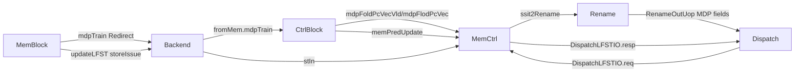

# mem/mdp: Memory Dependence Prediction

## Scope

- Source analyzed: local fallback checkout `xiangshan-code/mmu-smmpt/mmu-smmpt-module`, because the session has restricted network access and the authoritative GitHub source was not fetched in this run.
- Commit: `24b47b5b7818860e02f77a5c0d6c78e93f3aef6e`.
- Sync status: weekly sync helper ran on 2026-07-14. `XiangShanLab` was dirty, so it fetched and skipped pull; `XiangShan-Design-Doc` was missing.
- Files read: `mem/mdp/StoreSet.scala`, `mem/mdp/WaitTable.scala`, `backend/ctrlblock/MemCtrl.scala`, `backend/CtrlBlock.scala`, `backend/rename/Rename.scala`, `backend/dispatch/Dispatch.scala`, `mem/lsqueue/LoadQueueRAW.scala`, `mem/lsqueue/LoadQueue.scala`, `mem/lsqueue/LSQWrapper.scala`, `mem/lsqueue/NewStoreQueue.scala`, `mem/MemBlock.scala`, `Parameters.scala`, `backend/Bundles.scala`.
- Effective modules: `SSIT` and `LFST` are instantiated and connected by `MemCtrl`. `WaitTable` exists, but its output is not used in this configuration.

## Role

`mem/mdp` predicts load-store dependence so younger loads can be delayed before they execute past an older store whose address is not ready. The active design is store-set based:

- `SSIT` maps folded instruction PC to `{valid, ssid, strict}`.
- `LFST` maps each store-set ID to the most recent in-flight store ROB index.
- Rename annotates uops with store-set metadata.
- Dispatch asks `LFST` whether this uop should wait and which ROB index it should wait for.
- Store queue forwarding/check logic consumes `loadWaitBit`, `loadWaitStrict`, `waitForRobIdx`, `ssid`, and `storeSetHit` to force replay/wait when a predicted older store is still unresolved.
- Load-store RAW violation rollback trains the predictor.

This is XiangShan's code-level realization of the course concept "memory ordering as speculative dependency tracking": the core does not serialize every load behind every older store, but records dynamic dependence pairs and delays later matching loads.

## Evidence Table

| Topic | File:line | Core code | What it proves |
| --- | --- | --- | --- |
| MDP parameters | `Parameters.scala:817-830` | `WaitTableSize = 1024`, `SSITSize = WaitTableSize`, `LFSTSize = 32`, `SSIDWidth = log2Up(LFSTSize)`, `StoreSetEnable = true`, `LFSTEnable = true` | SSIT has 1024 PC-indexed entries; LFST has 32 SSIDs and 4 slots per SSID. |
| Active instantiation | `backend/ctrlblock/MemCtrl.scala:14-30` | `Module(new SSIT)`, `Module(new LFST)`, `io.waitTable2Rename := DontCare`, `io.ssit2Rename := ssit.io.rdata` | StoreSet path is live; WaitTable is disabled at the MemCtrl boundary. |
| Decode folded PC input | `backend/CtrlBlock.scala:638-652` | `mdpFlodPcVecVld(i) := decode.io.out(i).fire`, `mdpFlodPcVec(i) := decode.io.out(i).bits.foldpc` | SSIT lookup is driven by decode-stage folded PCs. |
| Rename metadata | `backend/rename/Rename.scala:433-439` | `storeSetHit := io.ssit(i).valid`, `loadWaitStrict := io.ssit(i).strict && io.ssit(i).valid`, `ssid := io.ssit(i).ssid`, `loadWaitBit := io.waittable(i)` | Rename attaches SSIT metadata to uops. Since waittable is DontCare in MemCtrl, dispatch later overwrites the effective wait decision. |
| Uop fields | `backend/Bundles.scala:282-290` | `storeSetHit`, `waitForRobIdx`, `loadWaitBit`, `loadWaitStrict`, `ssid` | These fields carry MDP state through backend and memory. |
| Dispatch LFST request | `backend/dispatch/Dispatch.scala:869-879` | `io.lfst.req(i).valid := fromRename(i).fire && updatedUop(i).storeSetHit`, then `loadWaitBit := io.lfst.resp(i).bits.shouldWait` | Dispatch queries LFST only when SSIT hit; LFST result overrides load wait control when StoreSet is enabled. |
| SSIT read | `mem/mdp/StoreSet.scala:125-140` | read ports use `io.ren`, `io.raddr`; outputs `valid`, `ssid`, `strict` | Decode reads SSIT and Rename sees the synchronous read result. |
| SSIT flush FSM | `mem/mdp/StoreSet.scala:142-168` | states `s_idle`, `s_flush`; flush writes `valid=false` entry by entry | Predictor valid state is periodically cleared under CSR timeout control. |
| SSIT update pipeline | `mem/mdp/StoreSet.scala:172-218` | update reads load/store PCs, registers to s2, computes allocated/winner SSID | Training is a multi-cycle read-modify-write update. |
| SSIT merge cases | `mem/mdp/StoreSet.scala:246-305` | cases `00`, `10`, `01`, `11`; winner SSID is smaller old SSID; same SSID sets strict | Implements store-set allocation and merging after a violation. |
| SSIT write collision rule | `mem/mdp/StoreSet.scala:308-315` | same write address disables store write port | If load/store folded PCs collide, load write wins and store write is suppressed. |
| LFST lookup | `mem/mdp/StoreSet.scala:383-412` | response waits if LFST valid or same dispatch-bundle store hit; CSR bits gate behavior | LFST converts SSID into a predicted older store ROB dependency. |
| LFST issue release | `mem/mdp/StoreSet.scala:414-422` | store issue clears matching `{ssid, robIdx}` entry | Once the predicted store address has issued, following loads no longer need to wait on it. |
| LFST store allocation | `mem/mdp/StoreSet.scala:424-437` | store dispatch writes `robIdxVec(waddr)(wptr)` and increments `allocPtr` | Dispatching a store records it as the latest store for that SSID. |
| LFST redirect cleanup | `mem/mdp/StoreSet.scala:439-459` | invalidates flushed ROB entries and repairs `allocPtr` one cycle after redirect | Wrong-path stores are removed from LFST. |
| RAW violation trains MDP | `mem/lsqueue/LoadQueueRAW.scala:379-398` | rollback redirect is selected oldest; `io.mdpTrain := Mux1H(oldestOH, allRedirect)` | Load-store violation redirects also become predictor training input. |
| Train path to backend | `mem/lsqueue/LoadQueue.scala:217-239`, `LSQWrapper.scala:98-100,236-242`, `MemBlock.scala:1053-1064` | `io.mdpTrain := loadQueueRAW.io.mdpTrain`, then LSQWrapper and MemBlock forward it | LSQ violation metadata reaches backend control. |
| PC reconstruction | `backend/CtrlBlock.scala:216-237` | uses load/store FTQ index and offset, folds PC to `ldpc`, `stpc`, `waddr`; update valid is delayed one cycle | Training converts redirect FTQ metadata back into SSIT/WaitTable indices. |
| Store queue wait consumer | `mem/lsqueue/NewStoreQueue.scala:365-372,491-493,603-606` | `s0StoreSetHitVec`, `s1HasAddrInvalid`, `addrInvalid.valid := s2HasAddrInvalid` | MDP metadata causes a load to replay/wait if predicted older store address is unresolved. |
| Disabled WaitTable | `mem/mdp/WaitTable.scala:33-70`, `MemCtrl.scala:28-30` | 2-bit table exists, but `waitTable2Rename := DontCare` | Alpha-21264-like wait table is implemented but not effective in this configuration. |

## Active Dynamic Flow

1. Frontend/IFU computes `foldpc`; decode emits it with each decoded uop. `CtrlBlock` forwards valid decode folded PCs to `MemCtrl` (`CtrlBlock.scala:638-652`).
2. `SSIT` reads `valid/ssid/strict` using the folded PC (`StoreSet.scala:125-140`).
3. Rename copies the SSIT result into uop control-flow metadata (`Rename.scala:433-436`).
4. Dispatch sends an LFST request for uops with `storeSetHit` (`Dispatch.scala:869-873`).
5. `LFST` returns `shouldWait` and a `robIdx` when an older unresolved store exists in the same SSID, including stores earlier in the same dispatch bundle (`StoreSet.scala:383-412`).
6. Dispatch overwrites the effective `loadWaitBit`, `waitForRobIdx`, and strict wait bit (`Dispatch.scala:875-879`).
7. NewStoreQueue uses that metadata during load forwarding/query. If the relevant older store address is invalid, it raises `addrInvalid`; strict mode waits for all older invalid-address stores, otherwise it waits only for predicted SSID/ROB match (`NewStoreQueue.scala:491-493,603-606`).
8. If a load actually violates ordering, `LoadQueueRAW` generates a rollback redirect and forwards the oldest such redirect as `mdpTrain` (`LoadQueueRAW.scala:379-398`).
9. Backend reconstructs load/store PCs from FTQ metadata and updates SSIT one cycle later (`CtrlBlock.scala:216-237`).

## SSIT Algorithm

SSIT is indexed by `MemPredPCWidth = log2Up(WaitTableSize)`, so folded PC selects one of 1024 entries. Each entry stores `{valid, ssid, strict}`.

Read path:

- Requesters: `DecodeWidth` decode slots.
- Qualification: `io.ren(i)`, connected from `decode.io.out(i).fire`.
- Timing: synchronous table read, decode address enters SSIT and read data is consumed by rename.
- Invalid behavior: invalid means no store-set hit; later dispatch will not ask LFST for that uop.

Update path:

- Requester: memory-dependence training redirect from LSQ.
- Stage 0: update request takes over read ports 0 and 1 for load/store PCs (`StoreSet.scala:172-187`). The comment says a redirect is sent, so decode will not need SSIT read that cycle.
- Stage 1: read old load/store SSIT entries (`StoreSet.scala:191-199`).
- Stage 2: compute `s2_ldSsidAllocate`, `s2_stSsidAllocate`, `s2_allocSsid`, and `s2_winnerSSID` (`StoreSet.scala:202-218`).
- Cases:
  - Neither assigned: allocate one SSID, the smaller folded hash of load/store PC, and write both entries (`StoreSet.scala:246-263`).
  - Load assigned, store not assigned: write store to the load-derived SSID allocation value (`StoreSet.scala:264-273`).
  - Store assigned, load not assigned: write load to the store-derived SSID allocation value (`StoreSet.scala:274-283`).
  - Both assigned: both entries are written to the smaller old SSID; if they were already the same SSID, the load entry becomes strict (`StoreSet.scala:284-304`).

The strict bit is XiangShan's extra conservative fallback. A repeated violation inside an already-merged store set means the predictor can no longer identify a precise one-store wait well enough, so the load waits for all older unresolved stores in StoreQueue.

Collision behavior:

- There are two SSIT write ports. If both write addresses match, store-port write enable is cleared (`StoreSet.scala:308-315`). Load entry update wins. This avoids a double write to the same `SyncDataModuleTemplate` address.

Flush lifecycle:

- Reset state is `s_flush`, not idle (`StoreSet.scala:144-147`).
- In `s_flush`, one SSIT valid bit is cleared per cycle using `resetStepCounter`; after entry `SSITSize - 1`, the FSM returns to idle (`StoreSet.scala:155-166`).
- In `s_idle`, CSR-controlled timeout bits trigger another flush (`StoreSet.scala:148-153`).

## LFST Algorithm

LFST state is indexed by `ssid`, with `LFSTWidth = 4` slots per SSID. It records ROB indexes of in-flight stores belonging to each store set.

Read/search:

- Requesters: `RenameWidth` dispatch lanes through `DispatchLFSTIO`.
- Same-bundle handling: for lane `i`, earlier lanes `0 until i` are searched for a valid store with the same SSID (`StoreSet.scala:387-397`). This catches a store and a dependent load dispatched together before the store has been inserted into LFST state.
- `shouldWait` is true when LFST has a valid entry or same-bundle store hit, request is valid, and the uop is a load unless `storeset_wait_store` also asks stores to wait. CSR `lvpred_disable` disables this unless `no_spec_load` forces waiting (`StoreSet.scala:398-403`).
- Returned `robIdx` defaults to the most recent allocated slot `allocPtr(ssid) - 1`, but same-bundle hits override it with the earlier store's ROB index (`StoreSet.scala:404-410`).

Update:

- On store dispatch, LFST writes the store ROB index at `allocPtr(ssid)`, sets valid, and increments `allocPtr` (`StoreSet.scala:424-437`).
- If the slot was already valid, `overflowVec(i)` is set (`StoreSet.scala:433-435`). The code records overflow for perf, but still overwrites the slot.

Release:

- When a store issues, each store-address execution unit broadcasts `storeIssue`. LFST clears any valid slot matching both SSID and ROB index (`StoreSet.scala:414-422`).
- This release point means "store address has been calculated/issued", which is exactly the condition younger predicted-dependent loads were waiting for.

Redirect cleanup:

- Any valid LFST slot whose ROB index `needFlush(io.redirect)` is cleared (`StoreSet.scala:439-446`).
- One cycle after redirect fire, `allocPtr` is repaired by scanning for invalid slots relative to the old allocation pointer (`StoreSet.scala:448-459`). This is explicitly marked as behavior-model code in the source.

## WaitTable Status

`WaitTable` implements an Alpha-21264-like 2-bit wait table:

- It has `WaitTableSize` 2-bit counters reset to zero (`WaitTable.scala:45`).
- Read returns selected counter bit or `no_spec_load`, masked by `!lvpred_disable` (`WaitTable.scala:49-52`).
- Update shifts in `true.B` at `update.waddr` (`WaitTable.scala:54-57`).
- CSR timeout clears the whole table (`WaitTable.scala:59-65`).

However, `MemCtrl` does not instantiate or connect it as live logic; `io.waitTable2Rename := DontCare` (`MemCtrl.scala:28-30`). Since `StoreSetEnable = true`, dispatch overwrites the load-wait decision using LFST response (`Dispatch.scala:875-879`). Treat WaitTable as legacy/disabled implementation in this analyzed configuration.

## Control And Data Path Diagram

```mermaid
flowchart LR
  Decode[Decode fire + foldpc] --> SSIT[SSIT read by folded PC]
  SSIT --> Rename[Rename uop: storeSetHit/ssid/strict]
  Rename --> Dispatch[Dispatch LFST request]
  Dispatch --> LFST[LFST: SSID -> older store ROB]
  LFST --> DispatchWait[loadWaitBit + waitForRobIdx]
  DispatchWait --> IssueMem[Load issue / StoreQueue query]
  IssueMem --> SQ[NewStoreQueue unresolved-store check]
  SQ --> Replay[addrInvalid / replay or wait]
  Replay --> LQRAW[LoadQueueRAW violation rollback]
  LQRAW --> CtrlBlock[CtrlBlock reconstructs ldpc/stpc]
  CtrlBlock --> SSITUpdate[SSIT training update]
  SSITUpdate --> SSIT
```



## Interface Diagram



## Timing Sketch

```waveform-draw
{
  "signal": [
    { "name": "clk", "wave": "p........" },
    { "name": "decode.fire", "wave": "01.0....." },
    { "name": "SSIT.raddr", "wave": "x=.x.....", "data": ["foldpc"] },
    { "name": "rename.ssit", "wave": "x.=x.....", "data": ["valid/ssid/strict"] },
    { "name": "dispatch.lfst.req", "wave": "0.10....." },
    { "name": "dispatch.lfst.resp", "wave": "0.=0.....", "data": ["wait/robIdx"] },
    { "name": "SQ.addrInvalid", "wave": "0...10..." },
    { "name": "mdpTrain.valid", "wave": "0.....10." },
    { "name": "SSIT.update", "wave": "0......10" }
  ],
  "config": { "hscale": 1 }
}
```

## Key Corner Cases

- Same dispatch bundle store/load: LFST checks earlier dispatch lanes, so a younger load can wait even before the older store has been committed into LFST state.
- Repeated violation after both PCs are already in the same SSID: SSIT marks the load strict, and StoreQueue turns strict wait into "any older unresolved store address blocks this load."
- Write collision on SSIT update: load-side update wins; store-side write is suppressed.
- Redirect: LFST clears wrong-path stores and later repairs allocation pointers. SSIT is not redirected; it is predictor state and only changes by training/timeout flush.
- CSR controls: `lvpred_disable` masks predictor waiting, `no_spec_load` forces waiting, `storeset_wait_store` extends waiting behavior to stores, and timeout controls periodic SSIT/WaitTable reset.

## Practical Summary

In this checkout, `mem/mdp` is not on the DCache data path directly. It is a speculation-control side path between decode/rename/dispatch and LSQ/store queue. The live predictor is StoreSet (`SSIT` plus `LFST`); `WaitTable` is present but disabled by `MemCtrl`. The training signal is not produced by ordinary cache miss/replay. It is produced when `LoadQueueRAW` detects a real read-after-write memory ordering violation and sends the oldest rollback redirect as `mdpTrain`.
